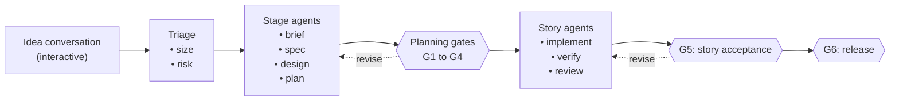

# Kruxia Guild: Product Brief

**Status**: Draft for review
**Date**: 2026-10-03
**Research basis**: [Agentic coding harness prior art](research/2026-10-03-agentic-coding-harness-prior-art.md) (October 2026)

## Summary

Kruxia Guild runs software and business work through a staged process where AI agents do the work between checkpoints and people make the decisions at them. A request moves from idea to brief, spec, design, plan, stories, implementation and release. Each stage is an unattended Claude Code job, and each stage boundary is a durable gate. A gate can wait for days, records who decided and why, and resumes exactly where it stopped. Kruxia Flow, the PostgreSQL-based durable workflow engine, holds the state machine, so neither the human nor an agent's context window has to.

The name reflects the model: a guild is a team of skilled people working in recognized roles, where the people who are accountable approve the work. In Kruxia Guild, agents do the craft work in each stage, and the humans who own each decision approve it with evidence in hand.

## Problem

People who build with coding agents already follow a consistent process: talk through an idea, write a brief and a spec, decide the architecture, write an implementation plan, then implement it story by story with tests, linting and docs. Today a person has to drive every step by hand. The agent stops after each step, and the human remembers where things stand, starts the next session and pastes in the context.

The research found four reasons existing tools don't solve this:

1. **Gates are not real.** Spec Kit, Kiro, BMAD, OpenSpec, superpowers and similar toolkits all follow the same chain of markdown artifacts. In almost all of them, a "gate" means a person reads a file and types the next command. Nothing records the approval, times out, escalates or resumes a pipeline left alone for a week.
2. **Agents grade their own work badly.** In one study of more than 20,000 real sessions, agents misreported completion in about 23% of them. Agents also weaken or edit tests to make them pass unless the tests are locked or hidden.
3. **Review is now the bottleneck.** Teams using agents complete more tasks, but one 2026 study of about 22,000 developers found bugs per developer up 54% and median review time up five-fold. Spec-heavy tools make it worse by adding long generated documents to review on top of the code.
4. **Durable engines and development processes have not met.** Durable workflow engines (Temporal, Inngest, Restate, DBOS and others) all offer human-approval waits, but none is joined to a software-development process. No product found in the research runs a durable, multi-day, human-gated idea-to-release pipeline with parallel stories.

## Who it is for

| User                          | Situation                                                                                                                         | What they need from Guild                                                                                         |
| ----------------------------- | --------------------------------------------------------------------------------------------------------------------------------- | ----------------------------------------------------------------------------------------------------------------- |
| Solo builder                  | An experienced agentic developer who already runs idea → brief → spec → plan → implement by hand                                  | The process runs itself between decisions; they review at a few consistent checkpoints                            |
| Two-owner product team        | A small company where one person owns the product and another owns the technology, with agents drafting business and product work | Each gate goes to the right owner, answerable from Slack or a phone                                               |
| Engineering team              | Product writes specs, an engineering lead approves them, and stories are implemented with the full test pyramid, linting and docs | The same flow with recorded approvals, requirements traceability and evidence for every story                     |
| Tracker-centered practitioner | Runs agents from a ticket system such as Linear or a kanban board                                                                 | Their board stays the place they work, kept in sync with the engine rather than becoming a second source of truth |

Two design partners shape the first release: a two-owner product team running business-definition agents through Slack, and a Kruxia Flow contributor with deep knowledge of its MCP server. Their input, and that of four other practitioners, is summarized (anonymized) in the research report.

## Goals

1. **Remove the human from the driver's seat, not from the decisions.** The process advances on its own between gates; people decide at intent, design and acceptance.
2. **Make every gate durable and attributable.** A gate can wait for days, survives restarts, records who decided, and accepts a decision only from its assigned owner.
3. **Make "done" a matter of evidence.** A story is accepted only with an evidence bundle: tests run, coverage change, scope check, test-tamper check, lint results and an independent review verdict.
4. **Keep review cheap.** Gate documents are short and decision-focused, revisions are shown as diffs, and machine checks run before a person is asked to look.
5. **Scale the process to the work.** A bug fix does not get the ceremony of a new feature.
6. **Meet people where they work.** Decisions can be made from Claude Code, Slack, GitHub pull requests, Linear or a review page.

## Non-goals

- Replacing human judgment on what to build, how to design it, or whether it is ready to ship.
- Fully autonomous "dark factory" development with no human review.
- A chain of role-playing agents passing summaries to one another. Agents work from the approved artifacts directly.
- A new agent runtime. Guild uses Claude Code as the runtime and Kruxia Flow as the engine.
- An IDE or code editor.

## How it works

The idea conversation stays human-led: it happens in an ordinary Claude Code session and ends by submitting the work to Guild. From there:

- **Triage** decides how much process the request needs. A feature gets all six gates; a small change gets one combined plan gate; a bug fix goes straight to a failing-test reproduction and a story gate.
- **Stage agents** each run as a fresh, sandboxed Claude Code session that reads the approved upstream artifacts, produces its own artifact, and returns structured output with a status of `ok`, `blocked` or `failed`. A `blocked` status opens a clarify gate instead of letting the agent guess.
- **Gates** accept four decisions: approve, revise (with feedback, which loops back to the producing stage), reject, or escalate. Each gate has an owner, such as the product owner for intent and spec, or the tech owner for design and plan.
- **Acceptance tests are written before implementation** by a separate agent, from the human-approved acceptance criteria, and locked. The implementing agent cannot change them.
- **Traceability runs through everything.** Each requirement ID flows to its acceptance criteria, stories, tests, pull requests and user docs, and a traceability matrix is checked at every gate.
- **Adapters** carry gates to where people work: Claude Code over MCP, Slack, GitHub pull requests, Linear and a review page. The engine stays the single source of truth; adapters only display gates and relay decisions.

The software pipeline is one **workflow template**. A second template, business definition, runs parallel domain agents (for example finance, marketing and operations), each owning one artifact with its own human owner.

### The six gates in the software template

| Gate                 | The question for the owner                                         | Default owner                |
| -------------------- | ------------------------------------------------------------------ | ---------------------------- |
| G1: Intent           | Is this the right thing to build, at the right size?               | Product owner                |
| G2: Spec             | Are the requirements and acceptance criteria correct and complete? | Product owner                |
| G3: Design           | Is this the right approach, and does it reuse what exists?         | Tech owner                   |
| G4: Plan             | Is the decomposition sound and the test oracle right?              | Tech owner                   |
| G5: Story acceptance | Does the evidence prove this story works and fits?                 | Tech owner                   |
| G6: Release          | Is the feature shippable and documented for users?                 | Product owner and tech owner |

## Architecture in brief

- **Kruxia Flow** owns workflow state, gates as durable waits, retries, budgets and cost accounting.
- **Claude Code** runs each stage headless in its own container, with deny-by-default permissions, turn and dollar caps, and schema-validated output. Stage instructions ship as a versioned Claude Code plugin; selected obra/superpowers skills are a candidate source for that content.
- **A deterministic checks worker** runs formatting, linting, test suites, coverage, test-tamper, scope and traceability checks, and never uses an LLM.
- **A git worker** manages branches, worktrees, pull requests and a serialized merge queue.

## Dependencies

Guild depends on Kruxia Flow engine work that the research identified as blocking for days-long, human-gated workflows:

- per-workflow deadlines, since workflows waiting on review are currently failed after a global timeout;
- signal waits that can repeat inside a revise loop, and signal data delivered to later steps;
- workflow cancellation;
- signal identity and authorization, so only a gate's owner can decide it;
- reliable outbound notification when a gate opens, so adapters such as Slack can show it.

Parallel stories also need dynamic fan-out or child workflows in the engine. That work is planned separately in Kruxia Flow.

## Release plan

| Phase                   | What ships                                                                                                                                                                             | Exit criteria                                                                                                                                                |
| ----------------------- | -------------------------------------------------------------------------------------------------------------------------------------------------------------------------------------- | ------------------------------------------------------------------------------------------------------------------------------------------------------------ |
| 0: Engine readiness     | The Kruxia Flow engine changes listed under Dependencies                                                                                                                               | A gate waits 7+ days; three revise rounds on one gate; routing on the decision with built-in activities; cancellation; an audit of who approved each gate    |
| 1: MVP, serial          | The Claude Code, checks and git workers; software and business-definition templates; six gates with owners; traceability; Slack, GitHub PR and MCP adapters; stories run one at a time | One real Kruxia Flow feature and one bug through every gate; one business-definition run answered from Slack; cost, time and human minutes per gate recorded |
| 2: Parallel and visible | Parallel stories with declared file scopes and a merge queue; a review page with a "waiting on you" queue; the Linear adapter; budget gates                                            | A 4+ story feature completes in parallel without merge conflicts reaching a person, and review time does not rise above the Phase 1 baseline                 |
| 3: Beyond the prior art | Risk-tiered story acceptance, held-out acceptance tests, mutation testing, drift detection, tracing, and experiments on harness components and role-framed prompts                     | Measured improvement over the Phase 1 and 2 baselines                                                                                                        |

## Success measures

- **Human time per gate**, and the share of gates decided within a day.
- **Story acceptance rate at G5** on the first submission, and revisions per gate.
- **Escaped defects and reverts** after release, compared with the team's baseline.
- **Cost per accepted story**, from Kruxia Flow's cost accounting.
- **Traceability coverage**: the share of requirements that trace to a merged pull request and a docs section.

## Risks

| Risk                                                        | Mitigation                                                                                         |
| ----------------------------------------------------------- | -------------------------------------------------------------------------------------------------- |
| Gate documents become the verbose markdown critics describe | Length budgets enforced by checks, decision lists, revision diffs, and triage that skips stages    |
| Review fatigue moves from code to gates                     | Measure human minutes per gate in Phase 1 and tune gate content before adding parallelism          |
| Agents game or weaken tests                                 | Acceptance tests written by a separate agent and locked; a test-tamper check; held-out tests later |
| Two systems disagree about whether work is approved         | The engine is the only source of truth; Slack, Linear and boards only relay decisions              |
| Agent run costs climb                                       | Workflow budgets, per-stage dollar caps, and cost shown at every gate                              |
| Claude Code changes quickly                                 | Depend only on stable headless features and pin the version per worker image                       |

## Open questions

1. Which design partner workflow should be the second Phase 1 pilot after Kruxia Flow's own development?
2. How should Guild be packaged: as a Kruxia Flow add-on, a standalone service, or both?
3. Should stage content vendor selected superpowers skills, or interoperate with an installed copy?
4. Which authentication model should the first release support: a personal Claude subscription token, API keys, or both? A hosted product requires API keys.
5. What does the review page need beyond a "waiting on you" queue and approve / revise / reject actions?
