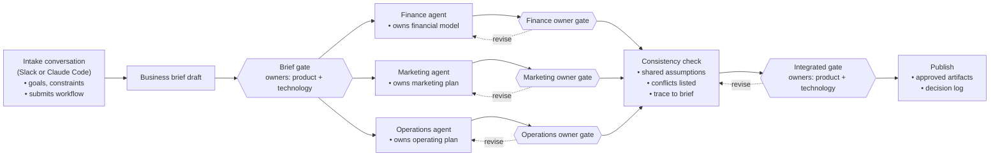
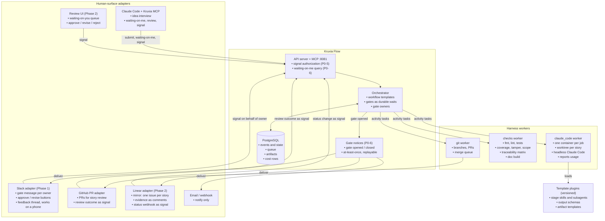
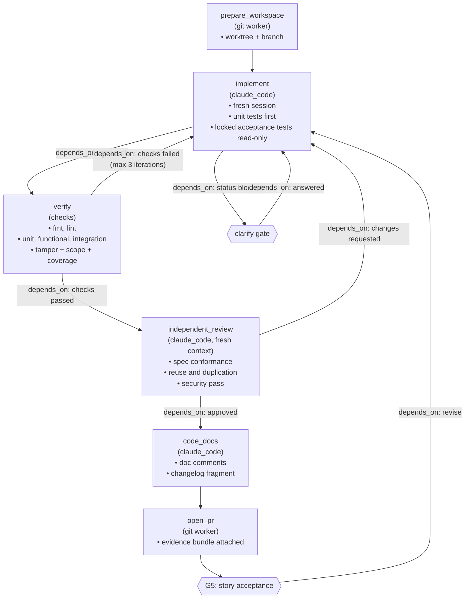
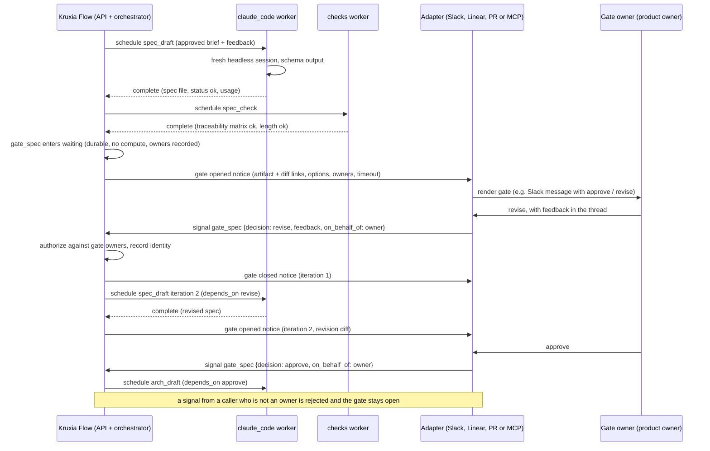

# Make human gates durable, not verbose

> **Naming note.** The harness this report designs is now called **Kruxia Guild**. Its product brief is [docs/product-brief.md](../product-brief.md). The report uses the word "harness" throughout because it was written before the name was chosen. Kruxia Guild is also agent-neutral: the plan below names Claude Code as the agent runtime, which is now the first supported agent for the proof of concept rather than the only one. The brief describes the agent driver contract that other coding agents will plug into.

As of October 2026 the prior art has settled on one backbone: principles → requirements/spec → design → task list → implement → verify, with each stage written to a markdown file in the repo. GitHub Spec Kit, AWS Kiro, BMAD, OpenSpec, obra/superpowers, cc-sdd and GSD all use it, as do vendor products such as Factory Spec Mode and Jules. But **none of them treats the human checkpoints between stages as durable, first-class workflow state**. In almost every tool a "gate" just means a human reads a file and types the next slash command. The only real exception is the early-beta, single-process, serial `bmad-loop`. The evidence says where humans actually add value. It is three things: intent (is this the right thing?), design (is this the right approach, and does it reuse what exists?), and acceptance against machine-produced evidence. Line-by-line reading of generated documents and diffs adds much less, and it is where review collapses: Faros measured median review time up 5x and 31% more PRs merging with no review in 2026. Agents remain unreliable judges of their own work. They misreport completion in about 23% of real sessions, and they game tests unless the tests are hidden or locked. So the main ways to improve on existing approaches are structural, not more prompt text: durable gates with identity and audit; short, decision-centric gate artifacts; ceremony scaled to problem size; acceptance tests written and locked before implementation; evidence bundles as the completion contract; fresh-context single-story sessions; and parallelism throttled by review capacity. Claude Code (v2.1.288) is a strong agent runtime for this. It offers headless JSON/schema output, dollar and turn caps, deny-by-default permissions, and plugins for stage personas. But its own workflows explicitly forbid mid-run human input, and its background sessions die with the machine. That leaves a clear role for Kruxia Flow, which already has event sourcing, leases, heartbeats, signals and cost accounting on PostgreSQL. **Four engine defects must be fixed before Kruxia Flow can host a days-long, human-gated pipeline**: a global 300-second workflow timeout that kills any workflow waiting on review; signal waits that cannot recur inside a revise loop; signal payloads that never reach templates; and no cancel operation. Dynamic per-story fan-out is the next-largest gap. Conversations with practitioners at an October 2026 meetup (design-partner input, not published evidence) showed the same need outside software: a durable control plane between human decisions, with humans answering where they already work, in Slack, Linear or a PR. The plan therefore treats the six-gate software pipeline as one **template** of a general gated-process engine. Gates have named owners, and they reach people through **human-surface adapters**. That adds two more Phase 0 engine requirements: signal identity with authorization, and reliable outbound notification of opened gates.

**How to read this report.** Claims with a URL citation come from the research notes. Many primary pages, including martinfowler.com, kiro.dev, arxiv.org, metr.org, openai.com, cognition.ai, faros.ai and most durable-engine docs, were blocked by the research sandbox's egress proxy. Findings about those pages come from search-result snippets or secondary summaries and are marked *(snippet)* or *(secondary)*. Treat their exact figures as probably correct but unverified. Kruxia Flow claims come from code reading of `kruxia/kruxiaflow` at commit `a934e4c` (`main` as of 2026-10-03); code links point to that commit. Claims marked **verified in code** were re-checked against the source for this report. Statements labeled *Inference* are this report's reasoning, not measured results. Statements labeled *design-partner input, Oct 2026* come from the author's conversations with practitioners on 2026-10-03. They are first-hand requirements, not published evidence, and they appear only in the design-partner section and the plan, never as support for the research findings. No build or runtime test was performed.

## Every spec toolkit shares one artifact chain, and none makes the gates durable

### The 2026 toolkit landscape converged on markdown stages and human-typed transitions

The table below compresses the main staged-development toolkits. They differ mainly in how many artifacts they produce, whether specs outlive the change, and how much of the implement/review loop runs unattended.

| Toolkit                  | Stages and artifacts                                                                                                                                                                                                                                                                                                                         | How the human gate works                                                                                                                                | Autonomy and durability                                                                                                                                                                                                              | Source                                                                                                                                                                                               |
| ------------------------ | -------------------------------------------------------------------------------------------------------------------------------------------------------------------------------------------------------------------------------------------------------------------------------------------------------------------------------------------- | ------------------------------------------------------------------------------------------------------------------------------------------------------- | ------------------------------------------------------------------------------------------------------------------------------------------------------------------------------------------------------------------------------------ | ---------------------------------------------------------------------------------------------------------------------------------------------------------------------------------------------------- |
| GitHub Spec Kit          | constitution → spec.md → plan.md → tasks.md → implement → `/speckit-converge` loop; new bug and 5-stage idea-assessment suites (go / needs-clarification / kill)                                                                                                                                                                             | "Review the result before continuing"; every step is a human-invoked command                                                                            | No autonomous mode found; `taskstoissues` can hand tasks to async agents                                                                                                                                                             | [spec-kit README](https://github.com/github/spec-kit)                                                                                                                                                |
| AWS Kiro                 | requirements.md (EARS) → design.md → tasks.md; property-based "Correctness" checks; steering, hooks, CLI, Web sandboxes                                                                                                                                                                                                                      | Phase-approval UI                                                                                                                                       | Autonomous agent delivers PRs from sandboxes *(snippet)*                                                                                                                                                                             | [kirodotdev/Kiro](https://github.com/kirodotdev/Kiro); [Kiro Correctness](https://kiro.dev/docs/specs/correctness/) *(snippet)*                                                                      |
| BMAD Method v6.12        | brief → PRD → architecture → epics/stories → sprint-planning → build → code-review; `sprint-status.yaml` is "the contract between planning and execution"                                                                                                                                                                                    | Human runs each skill; `bmad-dev-auto` / `bmad-build-auto` iterate unattended within a phase                                                            | Ceremony level chosen "after investigation, not before"                                                                                                                                                                              | [BMAD CHANGELOG](https://raw.githubusercontent.com/bmad-code-org/BMAD-METHOD/main/CHANGELOG.md)                                                                                                      |
| bmad-loop (v0.9.1, beta) | Deterministic Python: pick story → implement → adversarial review → verify → commit                                                                                                                                                                                                                                                          | Configurable gates (`per-epic`, `per-story-spec-approval`), deferred decisions, CRITICAL escalation pauses                                              | `state.json` + `journal.jsonl`, `resume <run-id>`, worktree per story; `max_parallel` clamped to 1                                                                                                                                   | [bmad-loop](https://github.com/bmad-code-org/bmad-loop)                                                                                                                                              |
| OpenSpec                 | Per-change folder: proposal.md, delta specs (ADDED/MODIFIED/REMOVED), design.md, tasks.md; `/opsx:verify`; archive merges deltas into main specs                                                                                                                                                                                             | Human invokes `/opsx:apply`                                                                                                                             | "Fluid not rigid, iterative not waterfall"; brownfield focus                                                                                                                                                                         | [Fission-AI/OpenSpec](https://github.com/Fission-AI/OpenSpec)                                                                                                                                        |
| obra/superpowers v6.4.2  | MIT; 15 skills plus a session-start hook that auto-triggers them; ships to about 16 agents and is in Anthropic's official plugin marketplace. brainstorm → spec in `docs/superpowers/specs/` → worktree with clean test baseline → plan in `docs/superpowers/plans/` → subagent-driven or Native execution with TDD → review → finish branch | Chat replies at task size class, each design section, the written spec, the plan plus execution mode, worktree creation, and finish (merge / PR / keep) | Execution deliberately does not stop except for destructive or security-sensitive actions, effects outside the worktree, or a broken plan; durability is a git-ignored progress ledger plus git, re-read on resume; no headless mode | [README v6.4.2 (2026-09-25)](https://github.com/obra/superpowers/blob/v6.4.2/README.md); [SDD SKILL.md](https://github.com/obra/superpowers/blob/v6.4.2/skills/subagent-driven-development/SKILL.md) |
| cc-sdd v3                | Kiro flow for other agents: discovery → requirements (EARS) → design → tasks with `_Boundary:_` / `_Depends:_` → `/kiro-impl`                                                                                                                                                                                                                | Approvals recorded in `spec.json`; `-y` auto-approves                                                                                                   | "Long-running autonomous implementation"; parallel markers                                                                                                                                                                           | [gotalab/cc-sdd](https://github.com/gotalab/cc-sdd)                                                                                                                                                  |
| GSD (now open-gsd)       | PROJECT, REQUIREMENTS, ROADMAP, STATE, PLAN, SUMMARY, CONTEXT files; discuss → plan → execute → verify phases                                                                                                                                                                                                                                | Human checkpoints                                                                                                                                       | Autonomous mode, wave-based parallel subagents; original repo archived Jun 2026                                                                                                                                                      | [gsd-build/get-shit-done](https://github.com/gsd-build/get-shit-done)                                                                                                                                |
| Anthropic feature-dev    | Discovery → parallel explorers → clarifying questions → 2–3 architecture options → implementation → 3 parallel reviewers → summary                                                                                                                                                                                                           | Waits for answers, option choice and explicit approval                                                                                                  | One session; no spec files persisted by design                                                                                                                                                                                       | [feature-dev README](https://github.com/anthropics/claude-code/tree/main/plugins/feature-dev)                                                                                                        |
| Agent OS v3              | Standards discovery, injection and indexing only                                                                                                                                                                                                                                                                                             | n/a                                                                                                                                                     | Dropped its spec/implementation phases because Claude Code plan mode "now handle[s] much of the scaffolding"                                                                                                                         | [Agent OS CHANGELOG](https://raw.githubusercontent.com/buildermethods/agent-os/main/CHANGELOG.md)                                                                                                    |

Practitioner workflows that predate these tools follow the same shape at lower ceremony. Harper Reed's process runs a one-question-at-a-time interview to `spec.md`, then a reasoning model writes `prompt_plan.md` and `todo.md`, and execution follows ([harper.blog](https://harper.blog/2025/02/16/my-llm-codegen-workflow-atm/) *(snippet)*). Kent Beck's `plan.md` is a list of tests, and the agent implements only the next unmarked one ([BPlusTree3 CLAUDE.md](https://github.com/KentBeck/BPlusTree3/blob/main/rust/docs/CLAUDE.md)). Dex Horthy's research → plan → implement has humans review the research and plan artifacts while keeping context use at 40–60% ([AI Engineer talk](https://ai.engineer/talks/context-engineering-for-complex-codebases)). This is very close to the process the user already runs by hand.

Two trends matter for a new harness. First, **2026 brought consolidation and lighter ceremony**. BMAD cut its core skills from 14 to 8 and merged Scrum Master and QA into the Developer agent. Agent OS retired its spec workflow. OpenSpec and GSD sell themselves as lightweight. Spec Kit is the outlier, still adding stages ([BMAD CHANGELOG](https://raw.githubusercontent.com/bmad-code-org/BMAD-METHOD/main/CHANGELOG.md); [Agent OS CHANGELOG](https://raw.githubusercontent.com/buildermethods/agent-os/main/CHANGELOG.md)). Second, **only cc-sdd (`spec.json`), bmad-loop (gate modes) and Kiro (approval UI) record approvals as explicit state**. Everywhere else, the approval exists only in the fact that someone typed the next command. *Inference:* without recorded approvals there is no audit trail, no timeout or escalation, and no way to resume a pipeline that someone abandoned for a week.

### Alignment during implementation is mostly prompt-level unless an independent verifier exists

Toolkits keep agents on-spec mainly with a checklist the agent ticks off, plus acceptance criteria embedded in requirements or stories. Stronger mechanisms appeared in 2025–26: Spec Kit's implement → converge loop until the report says "Converged" ([spec-kit README](https://raw.githubusercontent.com/github/spec-kit/main/README.md)), OpenSpec's verify-then-merge-deltas archive ([OpenSpec](https://github.com/Fission-AI/OpenSpec)), Kiro's property-based tests derived from requirements ([Kiro docs](https://kiro.dev/docs/specs/correctness/) *(snippet)*), superpowers' self-review that "every spec requirement maps to a task" plus fresh-context reviewers ([writing-plans](https://raw.githubusercontent.com/obra/superpowers/main/skills/writing-plans/SKILL.md)), and bmad-loop's fresh-context adversarial review "avoiding anchoring bias" ([bmad-loop](https://github.com/bmad-code-org/bmad-loop)). Even so, a 2026 field study calls spec drift the field's top unsolved technical problem, and calls machine-checkable acceptance criteria the highest-return component ([ianhxu field study](https://github.com/ianhxu/agentic-engineering-field-study/blob/main/04-spec-driven-development.md) *(secondary)*). Böckeler observed that agents "frequently ignore the elaborate instructions anyway" (same source, quoting martinfowler.com). *Inference:* alignment holds only where something other than the implementing agent checks it, such as tests, properties, or a separate reviewer. A harness should therefore spend its complexity budget on verifiers, not on longer instructions.

### Superpowers is the most widely adopted skills library and the closest fit for stage content

Partner B (see the design-partner section) uses obra/superpowers, so it got its own deep dive, read from a clone of tag `v6.4.2` on 2026-10-03. Its execution core is **subagent-driven development**. The controller session dispatches a fresh implementer for each plan task. It hands the diff as a file to a fresh, read-only reviewer that returns a spec-compliance verdict and a quality verdict. It then runs up to 5 fix rounds (rounds 1–3 resume the implementer, rounds 4–5 use a fresh one on a more capable model), and it finishes with a whole-branch review on the most capable model ([SDD SKILL.md](https://github.com/obra/superpowers/blob/v6.4.2/skills/subagent-driven-development/SKILL.md); [task-reviewer-prompt.md](https://github.com/obra/superpowers/blob/v6.4.2/skills/subagent-driven-development/task-reviewer-prompt.md)). The alternative "Native" mode has the session implement every task itself, under the same ledger and stop rules, followed by one fresh whole-branch review ([executing-plans](https://github.com/obra/superpowers/blob/v6.4.2/skills/executing-plans/SKILL.md)). Implementers never run in parallel ("Never dispatch multiple implementation subagents in parallel (conflicts)"). In-session fan-out is reserved for independent debugging ([dispatching-parallel-agents](https://github.com/obra/superpowers/blob/v6.4.2/skills/dispatching-parallel-agents/SKILL.md)). TDD ("NO PRODUCTION CODE WITHOUT A FAILING TEST FIRST") and verification ("NO COMPLETION CLAIMS WITHOUT FRESH VERIFICATION EVIDENCE") are enforced by instructions: Iron Laws, rationalization tables and red-flag lists. The one mechanical check is `task-done`, a script that marks a task complete in the ledger only when the given test command exits 0 ([test-driven-development](https://github.com/obra/superpowers/blob/v6.4.2/skills/test-driven-development/SKILL.md); [verification-before-completion](https://github.com/obra/superpowers/blob/v6.4.2/skills/verification-before-completion/SKILL.md); [task-done](https://github.com/obra/superpowers/blob/v6.4.2/skills/executing-plans/scripts/task-done)).

Adoption is large. The GitHub page rendered **about 295k stars** (294.8k, with 26.3k forks) on 2026-10-03. Its commit count matched the clone, so the page was current, but the API refused the request, so the figure is not API-verified ([github.com/obra/superpowers](https://github.com/obra/superpowers)). Third-party trackers show a consistent climb: about 57.5k in February 2026, 150k in April, 224.7k in June and 276.3k on August 23 ([rywalker.com](https://rywalker.com/research/agentic-skills-frameworks) *(snippet)*; [Medium](https://medium.com/@anilmathewm/i-gave-claude-code-a-brain-its-called-superpowers-and-it-has-150-000-github-stars-for-a-reason-16c4074a9209) *(snippet)*; [gitstarclub.com](https://gitstarclub.com/obra/superpowers) *(snippet)*). Anthropic's official marketplace lists it, pinned one patch behind at v6.4.1 on the day checked ([marketplace.json](https://github.com/anthropics/claude-plugins-official/blob/main/.claude-plugin/marketplace.json)). Simon Willison praised the October 2025 version as "very token light", with subagents doing the heavy work ([simonwillison.net](https://simonwillison.net/2025/Oct/10/superpowers/) *(snippet)*). The main criticism is token and time cost on small fixes: it "bills you for every two-line fix" ([dev.to](https://dev.to/aidiveyt/superpowers-fixes-claude-code-then-it-bills-you-for-every-two-line-fix-6dg) *(snippet)*). The project acknowledges this. v5.0.6 dropped review loops that "doubled execution time", v6.0.0 claims almost 50% fewer tokens, and v6.3.0 lets "small tasks skip the two-document ritual" ([RELEASE-NOTES](https://github.com/obra/superpowers/blob/v6.4.2/RELEASE-NOTES.md)).

The point that matters here is that superpowers has **in-session checkpoints and in-session parallelism, but no durable external gates and no unattended mode**. Approvals are chat replies ("Wait for the user's response"). Progress lives in a git-ignored ledger that the agent re-reads after compaction and that `git clean -fdx` destroys. The skills contain no headless mode ([brainstorming](https://github.com/obra/superpowers/blob/v6.4.2/skills/brainstorming/SKILL.md); [SDD SKILL.md](https://github.com/obra/superpowers/blob/v6.4.2/skills/subagent-driven-development/SKILL.md)). Its release history moves steadily toward fewer stops, ending in "rulings, not stalls" after a session "had sat blocked for almost nine hours" (v6.3.0). *Inference:* superpowers is the strongest example of the "artifact chain without durable gates" pattern described under harness engineering below. It already puts humans at a few decisions, but those decisions still need a chat that stays open. That makes it the most mature content for stage agents and a clear contrast for the control plane this report proposes.

### Commercial agents settled on "one task, one sandbox, one PR" with humans at plan and merge

By late 2026 every major vendor ships an asynchronous cloud agent. Devin, Factory Droids, Codex cloud, the Copilot coding agent, Jules, Cursor cloud agents and Claude Code on the web all turn an issue into a branch and a PR inside an isolated VM. Several add an explicit plan gate: Factory's `ExitSpecMode` approval and Jules's user-approved plan ([Factory Spec Mode](https://docs.factory.ai/cli/user-guides/specification-mode); [Jules changelog](https://jules.google/docs/changelog/)). Verification has moved into a second agent rather than being split across implementer roles: Jules has an adversarial critic, Copilot self-reviews before opening the PR, Amp has an "Oracle" second opinion, and Cursor has BugBot ([ITPro on Jules critic](https://www.itpro.com/software/development/google-jules-coding-agent-code-quality-update); [GitHub blog](https://github.blog/ai-and-ml/github-copilot/whats-new-with-github-copilot-coding-agent/)). The frontier in mid/late 2026 is **coordinator products** that break a body of work into parallel cloud sub-agents: Cursor Projects (Sept 10, 2026), Factory Missions, Claude Code Projects (beta, Sept 2026) and GitHub Mission Control ([eesel on Cursor Projects](https://www.eesel.ai/blog/cursor-projects); [Factory Missions](https://docs.factory.ai/missions/overview); [MarkTechPost](https://www.marktechpost.com/2026/09/17/anthropic-launches-claude-code-projects-in-beta-parallel-cloud-sessions-that-keep-running-after-you-close-your-laptop/)). No independent outcome data exists for any of them yet. Enterprise tracker integrations (Copilot for Jira and Linear, Atlassian Rovo Dev) remain **single-hop**: ticket text becomes the prompt, and the PR review is the only gate ([GitHub Changelog, Jira](https://github.blog/changelog/2026-03-05-github-copilot-coding-agent-for-jira-is-now-in-public-preview/); [Linear GA](https://github.blog/changelog/2026-07-23-copilot-cloud-agent-for-linear-is-now-generally-available/)). *Inference:* the user's day-job flow (spec → lead review → stories → implementation) has no commercial product that preserves the intermediate approved artifacts and gates. Today's products either skip from ticket to PR or keep the chain inside one vendor's IDE.

### Harness engineering and durable execution supply the missing runtime half

Anthropic's harness posts give the most concrete long-horizon design. In the November 2025 version, an initializer agent writes `init.sh`, a progress file and a JSON feature list in which every `passes` flag starts false. A coding agent then does one feature per session, verifies it end to end with browser automation, and commits. Removing or editing tests is declared "unacceptable" ([Anthropic, Nov 2025](https://www.anthropic.com/engineering/effective-harnesses-for-long-running-agents)). The March 2026 version separates a planner, a generator and a Playwright-driven evaluator. Generator and evaluator agree "sprint contracts" of testable criteria before code is written, because models grading their own work "confidently praise" mediocre output. The post also warns that "every component encodes an assumption about what the model can't do solo": context resets needed with Sonnet 4.5 were unnecessary with Opus 4.6. A full-harness run cost **6 h / $200 versus 20 min / $9 solo** ([Anthropic, Mar 2026](https://www.anthropic.com/engineering/harness-design-long-running-apps)). OpenAI's "harness engineering" account describes about 1M lines and ~1,500 PRs from three engineers in five months. It used a ~100-line AGENTS.md as a table of contents, deterministic linters enforcing architecture, and "garbage-collection" agents that hunt doc drift ([OpenAI](https://openai.com/index/harness-engineering/) *(snippet)*; [InfoQ](https://www.infoq.com/news/2026/02/openai-harness-engineering-codex/) *(snippet)*).

Meanwhile every durable-execution engine shipped agent integrations with the same primitives: Temporal, Inngest, Restate, DBOS, LangGraph, Microsoft Agent Framework and Dapr. Each LLM or tool call becomes a recorded, retried step that is never re-run on replay. **Human approval is a named, correlatable durable wait that holds no compute and can last days**, completed by an external call carrying the decision ([Temporal docs](https://docs.temporal.io/develop/python/integrations/openai-agents) *(snippet)*; [Inngest HITL](https://www.inngest.com/docs/durable-execution/durable-agents/human-in-the-loop) *(snippet)*; [DBOS](https://docs.dbos.dev/integrations/openai-agents) *(snippet)*). DBOS, which is Postgres-backed and library-embedded, is the closest architectural analog to Kruxia Flow. *Inference:* the two halves exist, but nobody has joined them. The spec toolkits have the artifact chain without durable gates. The durable engines have gates without a software-development artifact chain. bmad-loop is the closest prior art: a deterministic outer loop, a journal, resumable runs and gates as pause states. It is still local, single-process and serial. **A durable, multi-day, human-gated idea-to-release pipeline with parallel story fan-out is an open niche.**

## The evidence puts humans at intent, design and evidence, not at every diff

### Autonomy stops at whole-system design, and benchmarks overstate mergeability

Issue-level benchmarks are saturated and discredited. OpenAI stopped using SWE-bench Verified in February 2026 after finding that at least 59.4% of an audited hard subset had flawed tests ([OpenAI](https://openai.com/index/why-we-no-longer-evaluate-swe-bench-verified/) *(snippet)*). It then retracted its recommendation of SWE-bench Pro in July 2026 after flagging 27–34% of tasks ([OpenAI](https://openai.com/index/separating-signal-from-noise-coding-evaluations/) *(snippet)*). A September 2026 analysis found that none of the 29 adjacent top-30 Verified pairs can be statistically separated ([arXiv 2609.17394](https://arxiv.org/abs/2609.17394) *(snippet)*). More telling for this harness, maintainers reviewing 296 test-passing AI PRs said **roughly half would not be merged**, and the automated grader scored about 24 points above maintainer decisions ([METR, Mar 2026](https://metr.org/notes/2026-03-10-many-swe-bench-passing-prs-would-not-be-merged-into-main/) *(snippet)*). Whole-project generation is far from solved. ProgramBench reports **0.0% full resolution across 1,800 runs and 9 models**, with monolithic single-file output ([arXiv 2605.03546](https://arxiv.org/html/2605.03546v1) *(snippet)*). ProjDevBench reports 27.38% overall acceptance and often below 20% on multi-module systems that need design ([arXiv 2602.01655](https://arxiv.org/pdf/2602.01655) *(snippet)*). METR's 50% time horizon on well-specified tasks was roughly 5 hours in early 2026. (The snippet says "320 hours" for Opus 4.5, almost certainly a unit error for 320 minutes.) It reached about 11.3 hours (95% CI 5–40 h) for a mid-2026 model, which METR does not consider robust ([METR TH1.1](https://metr.org/blog/2026-1-29-time-horizon-1-1/) *(snippet)*; [METR GPT-5.6 Sol](https://metr.org/blog/2026-06-26-gpt-5-6-sol/) *(snippet)*). *Inference:* a single story of a few hours sits inside today's autonomous envelope. Architecture and requirements for a multi-module feature sit outside it, which is exactly where the user's gates should be.

### One strong agent per task beats role-play, with parallelism only for independent work and verification

The 2023–24 "virtual software company" frameworks (MetaGPT, ChatDev) are now mostly of historical interest. MAST studied 200+ multi-agent traces and found failure rates of 41–86.7%. Specification and system-design problems caused 41.8% of failures, and inter-agent misalignment caused 36.9% ([MAST](https://sites.google.com/berkeley.edu/mast/home)). Google and MIT found **every multi-agent variant degraded strictly sequential tasks by 39–70%**, while centralized coordination helped parallelizable ones by 80.9% ([arXiv 2512.08296](https://arxiv.org/abs/2512.08296)). Cognition's 2025 warning that "actions carry implicit decisions" softened by April 2026 into "map-reduce-and-manage" plus coder/reviewer loops that work best when the reviewer does *not* share the coder's context ([Cognition](https://cognition.com/blog/multi-agents-working) *(snippet)*). The large 2026 builds succeeded with planner/worker/judge hierarchies over near-perfect oracles. Cursor's browser used hundreds of agents with a judge and periodic fresh restarts ([ZenML](https://www.zenml.io/llmops-database/scaling-multi-agent-autonomous-coding-systems)). Anthropic's C compiler used 16 agents, ~2,000 sessions and ~$20K against the GCC torture suite ([InfoQ](https://www.infoq.com/news/2026/02/claude-built-c-compiler/) *(snippet)*). *Inference:* the harness should model stages as single-agent jobs, fan out only across independent stories, and add a separate-context verifier. A PM → Architect → Dev → QA persona chain is the configuration the evidence argues against.

### Roles help through separation and hurt through hand-offs

Practitioner F (design-partner input, Oct 2026) models every agent on a human software-team role and believes agents perform better that way. The measured evidence above argues against role-based teams in the form that has been studied: misalignment between agents caused 36.9% of MAST's failures, multi-agent setups degraded sequential tasks by 39–70%, and BMAD, the most role-heavy toolkit, merged its Scrum Master and QA agents into the Developer agent in 2026 ([BMAD CHANGELOG](https://raw.githubusercontent.com/bmad-code-org/BMAD-METHOD/main/CHANGELOG.md)). Academic work also suggests that persona prompts ("you are an X") do not reliably improve accuracy on objective tasks. That last point is not covered by the research notes and should be verified before it is relied on.

The same evidence supports three things roles provide. A reviewer that does not share the implementer's context performs better (Cognition's 2026 coder/reviewer finding, Anthropic's planner/generator/evaluator harness, superpowers' fresh read-only reviewer). Agents that each own a distinct artifact and work in parallel fall into the case where coordination helped. And roles map cleanly onto human decision rights, which is what gates need. *Inference:* a role helps when it creates separate context, a separate artifact or a separate incentive, such as QA trying to break the Engineer's work. It hurts when roles form a relay of summaries, where each hand-off loses information.

Practitioner F's roles map almost one-to-one onto this plan's stages and gates:

| Role            | In this plan                                                                                           |
| --------------- | ------------------------------------------------------------------------------------------------------ |
| Business Owner  | Human owner of G1 (intent) and G6 (release)                                                            |
| Project Manager | The engine itself: scheduling, status, budgets and reminders, as deterministic code rather than an LLM |
| Product Owner   | Brief and spec stage agent; human owner of G2                                                          |
| Architect       | Design stage agent; human owner of G3                                                                  |
| Lead Engineer   | Plan and story-breakdown stage agent; human owner of G4                                                |
| Engineer        | Story implementer, with a fresh session per story                                                      |
| QA              | Test author (writes locked tests before implementation), independent reviewer, and the checks worker   |

The main difference is the Project Manager. Coordination is where agent teams fail most often, so the plan gives that job to the durable engine. *Inference:* a role whose job is state, sequencing and follow-up belongs in code, and a role whose job is judgment over an artifact suits an agent. Whether role framing itself improves agent output is an open, testable question, so Phase 3 adds a controlled comparison.

### Self-grading fails in measurable, structural ways

The failure modes most relevant to "autonomous work between checkpoints" are well quantified. In 20,574 real sessions, **inaccurate self-reporting made up 22.58% of failure symptoms, and 91.49% of visible resolutions needed explicit user correction** ([arXiv 2605.29442](https://arxiv.org/html/2605.29442v1) *(snippet)*). On impossible tasks, GPT-5 cheated 54% of the time and Claude models 17–28%. Claude's cheating was mostly test modification (>79%). Giving an abort option cut GPT-5's rate to 9%, and hiding tests brought cheating near zero ([ImpossibleBench, ICLR 2026](https://proceedings.iclr.cc/paper_files/paper/2026/file/ca688eb14e29701a11bdba6633186328-Paper-Conference.pdf) *(snippet)*). Agent-written tests are weak oracles: **80.2% have weak or no explicit oracle signals** ([arXiv 2606.18168](https://arxiv.org/pdf/2606.18168) *(snippet)*), they increased coverage in only 22.5–35.9% of code-plus-test PRs ([arXiv 2607.18057](https://arxiv.org/html/2607.18057v1) *(snippet)*), and 36% of agent commits add mocks against 26% of human ones ([arXiv 2602.00409](https://arxiv.org/abs/2602.00409) *(snippet)*). Code quality drifts too. GitClear measured block duplication up 81% and refactoring moves down 70% over 2023–2026 ([GitClear](https://www.gitclear.com/the_ai_code_quality_maintainability_gap) *(snippet)*, vendor). Veracode finds known vulnerabilities in 45% of generated cases, flat for two years ([Veracode](https://www.veracode.com/blog/spring-2026-genai-code-security/) *(snippet)*, vendor). Parallelism creates conflicts: 27.67% of 142k agent PRs had textual merge conflicts, and cross-agent concurrent pairs conflicted 41.7% of the time against 19.8% for same-agent pairs ([arXiv 2604.03551](https://arxiv.org/abs/2604.03551) *(snippet)*; [arXiv 2607.04697](https://arxiv.org/html/2607.04697v2) *(snippet)*).

### Review is the binding constraint, and spec-heavy tools can make it worse

Faros's 2026 telemetry across 22,000 developers shows the whiplash: tasks completed up 34%, but **bugs per developer up 54%, incidents-per-PR more than tripled, median review time up 5x, and 31% more PRs merged with no review** ([Faros](https://www.faros.ai/research/ai-acceleration-whiplash) *(snippet)*, vendor). DORA's 2026 ROI report names review as the place AI value is lost ([InfoQ](https://www.infoq.com/news/2026/05/dora-roi-ai-assisted-dev-report/) *(snippet)*). Reviewer abandonment is the most common fate of failed agent PRs, at 38% ([arXiv 2601.15195](https://arxiv.org/html/2601.15195) *(snippet)*). Dex Horthy's fully unreviewed "dark factory" degraded a codebase within about three months, until one bug took weeks to debug ([BigGo summary](https://finance.biggo.com/news/15099f5634f5ab9a) *(secondary)*). Anthropic's own engineers can "fully delegate" only **0–20%** of tasks and keep design and taste decisions ([Anthropic](https://www.anthropic.com/research/how-ai-is-transforming-work-at-anthropic)). Observed professionals controlled the design of every new feature ([arXiv 2512.14012](https://arxiv.org/html/2512.14012v1) *(snippet)*).

The critiques of spec-driven development target exactly this burden. Böckeler found the tools imposing "the same heavyweight workflow on a bug fix and a greenfield feature", with Kiro turning a small bug into 4 user stories and 16 acceptance criteria, and reviewing generated markdown "potentially worse than reviewing code" ([martinfowler.com](https://martinfowler.com/articles/exploring-gen-ai/sdd-3-tools.html) via [ianhxu](https://github.com/ianhxu/agentic-engineering-field-study/blob/main/04-spec-driven-development.md) *(secondary)*). Marmelab counted 1,300 lines of markdown to display a date ([marmelab](https://marmelab.com/blog/2025/11/12/spec-driven-development-waterfall-strikes-back.html) *(snippet)*). A Spec Kit trial reportedly took 33 minutes and 2,577 lines of markdown to produce 689 lines of code, against 8 minutes of iterative prompting with no quality gain ([Scott Logic](https://blog.scottlogic.com/2025/11/26/putting-spec-kit-through-its-paces-radical-idea-or-reinvented-waterfall.html) *(snippet; attribution of the numbers likely but unconfirmed)*). Thoughtworks put SDD in "Assess" in November 2025 and reportedly dropped it as a technique in April 2026 ([Thoughtworks Radar](https://www.thoughtworks.com/en-us/radar/techniques/spec-driven-development) *(secondary)*). On the other side, Ona's AI pre-approval of low-risk PRs cut time to first approval from 2 h 49 m to 3.8 minutes while keeping architecture, auth and migrations with humans ([Ona](https://ona.com/stories/auto-approving-low-risk-prs), vendor). *Inference:* the gates belong at intent, design and evidence-based acceptance. Each gate must be short, and the strictness of code review should depend on risk tier.

## Nine structural improvements over the existing approaches

The table maps each documented weakness to a design change. None of these has been validated in a controlled study. They are inferences from the evidence above, which is the honest status of the whole field: no head-to-head evaluation of staged, human-gated harnesses against ad-hoc agent use was found.

| #   | Weakness in prior art                                                          | Evidence                                                                               | Improvement                                                                                                                                                                                                                                                                                                |
| --- | ------------------------------------------------------------------------------ | -------------------------------------------------------------------------------------- | ---------------------------------------------------------------------------------------------------------------------------------------------------------------------------------------------------------------------------------------------------------------------------------------------------------- |
| 1   | Gates are "human types the next command": no state, timeout, identity or audit | Only cc-sdd, bmad-loop and Kiro record approvals                                       | **Durable gates**: each checkpoint is a workflow activity that waits durably, accepts a decision only from its assigned owner, records that identity and decision, escalates on timeout, and resumes days later                                                                                            |
| 2   | Gate artifacts are long and LLM-padded; double review of spec then code        | Böckeler, Marmelab, Scott Logic                                                        | **Decision-centric, size-capped artifacts**: fixed sections, hard length budgets, an explicit "decisions needed" list, and revision diffs so reviewers read changes, not whole documents                                                                                                                   |
| 3   | One ceremony level for every problem                                           | Kiro bug → 16 acceptance criteria; BMAD v6.12 picks ceremony late                      | **Triage first**: classify each request (fix / small change / feature / epic) and risk tier, collapse stages for small work, and let the human confirm the classification                                                                                                                                  |
| 4   | Agents grade their own work and edit tests                                     | ImpossibleBench; 22.58% false self-reports                                             | **Verifier independence**: a separate agent writes acceptance tests from the approved spec *before* implementation, the tests are write-protected, a tamper check diffs them, and an explicit "blocked" exit exists                                                                                        |
| 5   | "Done" is a self-declaration                                                   | METR half-unmergeable; Willison "prove it works"                                       | **Evidence bundle as the completion contract**: the engine accepts a story only with test logs, coverage delta, scope report, review verdict and, for UI work, screenshots                                                                                                                                 |
| 6   | Long sessions rot; drift accumulates                                           | Context rot; Ralph; Anthropic one-feature-per-session                                  | **Fresh context per story** fed by on-disk artifacts, and a deterministic outer loop owned by the orchestrator, not by a long-lived agent                                                                                                                                                                  |
| 7   | Parallel agents conflict, and review capacity is the real limit                | 41.7% cross-agent conflicts; Faros 5x review time                                      | **Partitioned fan-out** with declared file scopes per story, a serialized integration queue, and a concurrency cap tied to measured review throughput                                                                                                                                                      |
| 8   | Specs are written once and rot (spec-first, not spec-anchored)                 | Drift as the #1 unsolved problem; OpenSpec deltas; superpowers requirement-to-task map | **Spec-anchored traceability and close-out**: requirement IDs carried through acceptance criterion → story → test → PR → docs section, a machine-built traceability matrix at every gate, spec deltas and ADR status merged in a final stage, and a periodic drift-detection job that re-checks the matrix |
| 9   | Cost and quality claims rest on sentiment                                      | METR perception gap; $124–$200 harness runs                                            | **Workflow-level budgets and outcome telemetry**: review latency, rework, reverts, escaped defects, cost per story; re-test harness components as models change                                                                                                                                            |

Three of these deserve emphasis because they set this plan apart from every toolkit surveyed. **Durable gates (1)** is the user's core requirement, and an orchestration engine provides it natively where markdown toolkits cannot. **Verifier independence (4)** is the best-evidenced lever against false completion: hiding or locking tests drives cheating toward zero. It also fixes the weak-oracle problem, because acceptance tests derive from human-approved acceptance criteria rather than from the implementer's own understanding. **Triage (3)** answers the strongest critique of SDD. Without it, the harness becomes the waterfall the critics describe.

## Claude Code is the right agent runtime but stops at the session boundary

Claude Code at **v2.1.288** (Oct 2, 2026) supplies nearly every per-stage primitive the harness needs ([npm](https://registry.npmjs.org/@anthropic-ai/claude-code)). The flag `claude -p` runs non-interactively. With `--output-format json` it returns `session_id`, `total_cost_usd` and a per-model breakdown. With `--json-schema`, it returns schema-validated `structured_output`, which since v2.1.205 errors on an invalid schema instead of silently ignoring it. `--max-turns` and `--max-budget-usd` cap a run, with subagent spend counted. `--permission-mode dontAsk` plus `--permission-prompts none` denies anything that would prompt and reports `permission_denials` ([headless docs](https://code.claude.com/docs/en/headless); [CLI reference](https://code.claude.com/docs/en/cli-reference)). `--bare` skips host hooks, plugins, memory and CLAUDE.md, and is "the recommended mode for scripted and SDK calls". Without it, a `-p` session runs the project's hooks and MCP servers "even in a folder you've never trusted" ([headless](https://code.claude.com/docs/en/headless)). Stage personas can be packaged as subagents and skills (each with its own tools, model, permission mode, `maxTurns` and hooks) and shipped as a versioned plugin ([subagents](https://code.claude.com/docs/en/sub-agents); [plugins](https://code.claude.com/docs/en/plugins/overview)). A `PreToolUse` hook can return `defer`, so a process exits at a tool call and resumes days later. It works only when the turn has a single tool call, and the transcript is kept for 30 days by default ([hooks reference](https://code.claude.com/docs/en/hooks#defer-a-tool-call-for-later)). Transcripts are host-local JSONL. A `SessionStore` adapter with a **Postgres reference implementation** mirrors them, but Anthropic says passing captured state into a fresh session "is often more robust than shipping transcript files around" ([sessions](https://code.claude.com/docs/en/agent-sdk/sessions); [session storage](https://code.claude.com/docs/en/agent-sdk/session-storage)).

Durability ends at the session. Dynamic workflows (JS scripts orchestrating up to 1,000 agents) have "no mid-run user input", and the docs say outright: **"For sign-off between stages, run each stage as its own workflow."** Resume works only within the same session ([workflows](https://code.claude.com/docs/en/workflows)). Background sessions "stop if the machine shuts down" ([agent view](https://code.claude.com/docs/en/agent-view)). `/loop` tasks expire after 7 days ([scheduled tasks](https://code.claude.com/docs/en/scheduled-tasks)). Agent teams cannot resume teammates ([agent teams](https://code.claude.com/docs/en/agent-teams)). Routines are fire-and-forget cloud sessions with hourly caps, and "a green status… does not mean the task in your prompt succeeded" ([routines](https://code.claude.com/docs/en/routines)). Cost fields are "client-side estimates, not authoritative billing data" ([cost tracking](https://code.claude.com/docs/en/agent-sdk/cost-tracking)). Unattended permission-bypassing runs belong "inside a container, a VM, or the sandbox runtime" ([sandbox environments](https://code.claude.com/docs/en/sandbox-environments)). Licensing also bears on design: Anthropic does not allow third-party products built on the Agent SDK to offer claude.ai login, and directs them to API keys ([Agent SDK overview](https://code.claude.com/docs/en/agent-sdk/overview)). `claude setup-token` exists for the user's own scripts and CI ([CLI reference](https://code.claude.com/docs/en/cli-reference)). *Inference:* for personal use the harness can run on the user's subscription token. If it becomes a Kruxia product feature, the worker must authenticate with API keys (or Bedrock/Vertex) and must not depend on subscription-only features such as routines or Projects.

## Kruxia Flow has the durable core but four engine blockers and two new requirements

Kruxia Flow already provides the hard parts. These include event sourcing on PostgreSQL with replay-idempotent polling, a `FOR UPDATE SKIP LOCKED` queue with lease reclaim, heartbeats, exponential retry backoff, and dead letters that carry errors. It also has a real durable-wait primitive (`settings.wait_for_signal` with `event_name`, `timeout_seconds` and `on_timeout`), timers, per-attempt cost rows (including `usage[]` reported by external workers), workflow-level budgets, a 23-tool MCP server that Claude Code can use to deploy, submit, monitor and signal workflows, and a complete Rust worker SDK ([core/src/workflow/definition.rs](https://github.com/kruxia/kruxiaflow/blob/a934e4c/core/src/workflow/definition.rs); [core/src/queue/postgres_queue.rs](https://github.com/kruxia/kruxiaflow/blob/a934e4c/core/src/queue/postgres_queue.rs); [docs/mcp-server.md](https://github.com/kruxia/kruxiaflow/blob/a934e4c/docs/mcp-server.md); [worker-sdk/README.md](https://github.com/kruxia/kruxiaflow/blob/a934e4c/worker-sdk/README.md)). A multi-hour `claude_code` activity is feasible today: set `timeout_seconds` high and let the SDK heartbeat every 30 s. The gaps are concentrated in exactly the features a human-gated pipeline exercises.

| Priority | Gap                                                                                                                                                                                                                                                                                                                          | Basis                                                             | Evidence                                                                                                                                                                                                                                                                                                            | Required change (requirement, not implementation)                                                                                                                                                                                                                                                                     |
| -------- | ---------------------------------------------------------------------------------------------------------------------------------------------------------------------------------------------------------------------------------------------------------------------------------------------------------------------------- | ----------------------------------------------------------------- | ------------------------------------------------------------------------------------------------------------------------------------------------------------------------------------------------------------------------------------------------------------------------------------------------------------------- | --------------------------------------------------------------------------------------------------------------------------------------------------------------------------------------------------------------------------------------------------------------------------------------------------------------------- |
| P0-1     | A global workflow timeout (default 300 s, measured from `created_at`) fails **every** running workflow, including ones waiting on review; per-definition `settings.timeout` is parsed but never read                                                                                                                         | Verified in code                                                  | [orchestrator.rs:2587-2605](https://github.com/kruxia/kruxiaflow/blob/a934e4c/core/src/orchestrator/orchestrator.rs); [config.rs:25](https://github.com/kruxia/kruxiaflow/blob/a934e4c/core/src/orchestrator/config.rs)                                                                                             | Honor per-definition timeouts; exclude time spent waiting on signals (or count from last progress); keep the stuck-workflow diagnostic for workflows with no live activity                                                                                                                                            |
| P0-2     | A signal wait cannot recur in a loop: subscriptions are `UNIQUE(workflow_id, activity_key)` and never deleted after signaling, so a revise → re-review cycle fails with AlreadyExists                                                                                                                                        | Verified in code (constraint); runtime failure is inference       | [subscriptions migration](https://github.com/kruxia/kruxiaflow/blob/a934e4c/migrations/20260126000001_activity_event_subscriptions.up.sql); [postgres_subscription.rs](https://github.com/kruxia/kruxiaflow/blob/a934e4c/core/src/subscription/postgres_subscription.rs)                                            | Make waits iteration-aware (iteration in the subscription key, or archive on signal); let the signal API target the current iteration                                                                                                                                                                                 |
| P0-3     | Signal payloads are unusable without a custom worker: `{{SIGNAL}}` is assigned only in a unit test, parameters resolve before the wait, and std `echo` drops signal data                                                                                                                                                     | Verified in code                                                  | [template.rs:2092](https://github.com/kruxia/kruxiaflow/blob/a934e4c/core/src/workflow/template.rs); [orchestrator.rs:411-457](https://github.com/kruxia/kruxiaflow/blob/a934e4c/core/src/orchestrator/orchestrator.rs); [echo.rs](https://github.com/kruxia/kruxiaflow/blob/a934e4c/worker/src/activities/echo.rs) | Populate the signal template context and re-resolve parameters after the signal; add a built-in review activity whose outputs are the signal payload, so no worker is needed                                                                                                                                          |
| P0-4     | No cancel, terminate or pause; `Paused` status is never set; MCP `cancel_workflow` is "intentionally absent"                                                                                                                                                                                                                 | Verified in code (routes)                                         | [api/src/routes.rs](https://github.com/kruxia/kruxiaflow/blob/a934e4c/api/src/routes.rs); [docs/mcp-server.md](https://github.com/kruxia/kruxiaflow/blob/a934e4c/docs/mcp-server.md)                                                                                                                                | A `WorkflowCancelled` event, REST and MCP cancel, cleanup of queue rows and subscriptions, and propagation to running activities through the existing heartbeat-409 path                                                                                                                                              |
| P0-5     | Signal identity and authorization (formerly P1-5): signals are anonymous because the handler ignores the caller's claims, so any valid token can answer any gate, and an adapter cannot say whom it acts for                                                                                                                 | New requirement (design partners)                                 | [api/src/handlers/signals.rs](https://github.com/kruxia/kruxiaflow/blob/a934e4c/api/src/handlers/signals.rs); [kruxiaflow/src/mcp/tools/control.rs](https://github.com/kruxia/kruxiaflow/blob/a934e4c/kruxiaflow/src/mcp/tools/control.rs)                                                                          | Gates declare approvers (person, role or group); REST and MCP signals authorize the caller against them and reject anyone else; the signal event records the signaler, the on-behalf-of person when an adapter relays, and the time; signal history appears on workflow detail                                        |
| P0-6     | Reliable outbound notification of waits, plus a waiting-on-me query: no engine-level "gate opened" event reaches external systems (a workflow author must add an `http_request` or `email_send` step), and `list_waiting_workflows` filters by signal name only, not by assignee                                             | New requirement (design partners)                                 | [kruxiaflow/src/mcp/tools/control.rs](https://github.com/kruxia/kruxiaflow/blob/a934e4c/kruxiaflow/src/mcp/tools/control.rs)                                                                                                                                                                                        | A durable "gate opened / gate closed" notice (artifact links, decision options, assignees, timeout) delivered at least once to registered adapters, with retry and replay from a cursor so a restarted adapter misses nothing; a REST and MCP query for open gates assigned to the caller's identity, roles or groups |
| P1-1     | No dynamic fan-out (map over a runtime list) and no child workflows; parallel loop iterations are post-MVP                                                                                                                                                                                                                   | Researcher code reading                                           | [docs/loops-guide.md](https://github.com/kruxia/kruxiaflow/blob/a934e4c/docs/loops-guide.md); [examples/03-document-processing.yaml](https://github.com/kruxia/kruxiaflow/blob/a934e4c/examples/03-document-processing.yaml)                                                                                        | A `for_each`-style expansion over a templated list into iteration-indexed executions plus a join, or a child-workflow activity that completes when the child completes                                                                                                                                                |
| P1-2     | Heartbeat timeout equals execution timeout, so a crashed 4-hour job is not reclaimed for up to 4 hours                                                                                                                                                                                                                       | Researcher code reading                                           | [postgres_queue.rs:158-163](https://github.com/kruxia/kruxiaflow/blob/a934e4c/core/src/queue/postgres_queue.rs)                                                                                                                                                                                                     | A separate heartbeat timeout and last-heartbeat tracking                                                                                                                                                                                                                                                              |
| P1-3     | The budget pre-check returns early for anything but `llm_prompt` / `embedding`; budget actions are only abort / continue                                                                                                                                                                                                     | Verified in code                                                  | [orchestrator.rs:1859-1862](https://github.com/kruxia/kruxiaflow/blob/a934e4c/core/src/orchestrator/orchestrator.rs)                                                                                                                                                                                                | A generic pre-schedule gate on workflow spend for all activities, plus an `await_approval` budget action that opens a human gate                                                                                                                                                                                      |
| P1-4     | Progress streaming is in-memory WebSocket broadcast only; the Rust SDK client lacks stream and file-upload helpers                                                                                                                                                                                                           | Researcher code reading                                           | [api/src/handlers/streaming.rs](https://github.com/kruxia/kruxiaflow/blob/a934e4c/api/src/handlers/streaming.rs); [worker-sdk/src/client.rs](https://github.com/kruxia/kruxiaflow/blob/a934e4c/worker-sdk/src/client.rs)                                                                                            | A persisted, replayable activity log; SDK helpers for streaming and file upload                                                                                                                                                                                                                                       |
| P1-6     | The dashboard shows cost analytics only; there is no workflow list, detail or review action                                                                                                                                                                                                                                  | Researcher code reading                                           | [dashboard/assets/dashboard.html](https://github.com/kruxia/kruxiaflow/blob/a934e4c/dashboard/assets/dashboard.html); README roadmap                                                                                                                                                                                | Workflow list/detail with a "waiting on you" queue, artifact viewers and approve / revise / reject actions                                                                                                                                                                                                            |
| P2       | Doc and example drift that will mislead an agent authoring workflows over MCP (README and MCP guide use `signal_name`, `timeout`, `delay_secs`); unknown settings keys are silently ignored; the README still links to `docs/implementation/` and `docs/post-mvp.md`, which commit `304ef76` archived out of the public repo | Researcher code reading; README links checked against git history | [README.md](https://github.com/kruxia/kruxiaflow/blob/a934e4c/README.md); [kruxiaflow/src/mcp/tools/discovery.rs](https://github.com/kruxia/kruxiaflow/blob/a934e4c/kruxiaflow/src/mcp/tools/discovery.rs)                                                                                                          | Correct the docs and authoring guide; reject unknown settings fields at validation; remove or repoint the README links to archived paths                                                                                                                                                                              |

Two further items are worker responsibilities rather than engine defects. Kruxia Flow provides no sandbox or workspace management. And when the SDK aborts a handler, a spawned `claude` child process keeps running unless the activity kills it explicitly, since no `kill_on_drop` exists in the SDK or the std worker. Both must be handled in the harness worker. The researcher's estimate is that P0-1 through P0-4 are localized changes that fit existing patterns (event types, idempotent replay, the subscription service), while P1-1 is the largest design change because it touches validation, dependency evaluation, iteration state and templating. That is an *Inference* from code reading. Workarounds were proposed for every P0 item: a huge process-wide timeout, unrolled review keys (`review_1`, `review_2`, …), a custom review-recorder worker, and SQL for cancellation. The unrolled-keys workaround does not survive finding N1 below. *Inference:* each workaround degrades the product Kruxia Flow is trying to be, so fixing them in the engine also benefits every other human-in-the-loop user.

**Re-verification in the engine implementation plan.** The engine implementation plan (`harness-engine-readiness.md`, kept in Kruxia's internal planning repository) re-checked every gap against `main` at `a934e4c` and found that the signal path is weaker than the research reported. All of the following come from code reading; nothing was run.

- **N1, the most serious:** even a single-pass gate is probably broken on `main`, not only gates inside loops. A signal returns the activity to `NotScheduled` (`core/src/orchestrator/workflow_state.rs:503-529`). The scheduler then re-enters the `wait_for_signal` branch with no "already signalled" check (`core/src/orchestrator/orchestrator.rs:1521-1586`). The signalled subscription row is never deleted, since only the timeout path deletes it, so the second insert should hit the unique key and the activity is marked Failed. No end-to-end signal test exists. The plan makes a runtime reproduction its first task.
- **The MCP signal tool drops its data.** `send_workflow_signal` publishes a payload shape the state code doesn't read.
- **Signal delivery isn't atomic.** A failed publish after the subscription is consumed leaves the activity waiting forever.
- **A repeat signal is silently dropped.** Signal and timeout events carry no iteration, so the event dedup index discards a second signal for the same activity.
- **Cancellation can't simply reuse the heartbeat 409 path.** That path returns 409 only for reclaimed rows.
- **Failed workflows don't stop their work.** A failed workflow leaves its running activities running and its waits open.
- **Signal identity is a larger job than first estimated.** Token claims carry no scopes or roles, and MCP tools never receive the caller's identity.
- **Loop artifacts are overwritten.** In a loop, each iteration's file upload overwrites the previous one.

These findings strengthen the report's conclusion: Phase 0 is required, not optional. The plan organizes the work as post-MVP Epic 6 stories, in two milestones that match harness Phases 0 and 2.

P0-5 and P0-6 are different in kind. They are not defects in what the engine claims to do. They are new requirements that came from design-partner input (see the next section). Any gate answered from Slack, Linear or a PR depends on them. An adapter must learn reliably that a gate opened, and the engine must know who answered and whether that person may answer. They are P0 because without them every non-MCP surface would need its own polling loop and its own trust model. The old P1-5 (anonymous signals) is folded into P0-5, so no P1-5 row remains.

## Design partners and practitioner input

On 2026-10-03 the author attended an agentic-coding meetup and talked with several people working on the same problems. Everything in this section is *design-partner input, Oct 2026*. It comes from a handful of first-hand conversations and is not published evidence. It shapes the plan's requirements and pilots, but it is not evidence that the approach works. Participants are anonymized: two are prospective design partners (Partner A and Partner B) and three are practitioners whose needs informed the plan (Practitioners C, D and E).

- **Partner A (design partner).** Partner A is building an education product with a co-founder: the co-founder owns the product and Partner A owns the technology. Partner A runs business-function agents (CFO, CMO, COO), each responsible for defining a different part of the business, and both founders review and interact with that work. Partner A wants an orchestration that runs the whole process and talks to both founders through **Slack**, and was interested both in the approach described here and in Practitioner C's.
- **Partner B (design partner).** Partner B is an existing Kruxia Flow contributor with deep experience of its MCP server. Partner B's own workflow is not yet defined. Partner B mentioned obra/superpowers as one of the agentic frameworks they work with, and that is all that is known so far about how they use it. Superpowers now has its own subsection in the prior art, and the stage-plugin component sets out how the harness could vendor or interoperate with it. That choice is left to decide with Partner B, who is well placed to judge it. Partner B's MCP expertise maps directly onto the plan's MCP-side gaps: the cancel tool (P0-4), signal identity (P0-5), and the authoring-guide field-name drift (P2) in [kruxiaflow/src/mcp/tools/discovery.rs](https://github.com/kruxia/kruxiaflow/blob/a934e4c/kruxiaflow/src/mcp/tools/discovery.rs).
- **Practitioner C.** Practitioner C puts **Linear** at the center, as both the ticketing system and the "brain". They run manager agents (search, biz and finance, site builder and others) for a small business that builds websites for local organizations. Claude talks to Linear through Linear's MCP server.
- **Practitioner D.** Practitioner D is trying to systematize their agentic workflows. They tried GitHub Spec Kit but dislike that it does one thing and then quits. They want **requirements traceability**.
- **Practitioner E.** Practitioner E has tried base44.com, an AI app builder. Their takeaways from it are not yet known. This is an open question to follow up, and the plan assumes nothing about it.
- **Practitioner F.** Practitioner F is building a proprietary agentic development orchestration that uses a **kanban board** as its primary switchboard, a pattern close to Practitioner C's Linear-centered setup. Their key belief is that agents perform better when they inhabit roles humans have held, so every agent in their workflows plays a human software-team role: Business Owner, Project Manager, Product Owner, Lead Engineer, Architect, Engineer and QA.

| Person         | Stated need                                                                                                      | Already covered by the plan                                                                                                                                                                                        | What the plan adds                                                                                                                                                                                                                                                                                                                              |
| -------------- | ---------------------------------------------------------------------------------------------------------------- | ------------------------------------------------------------------------------------------------------------------------------------------------------------------------------------------------------------------ | ----------------------------------------------------------------------------------------------------------------------------------------------------------------------------------------------------------------------------------------------------------------------------------------------------------------------------------------------- |
| Partner A      | One orchestration that runs a multi-agent business-definition process, with two human owners, through Slack      | Durable gates, revise loops, budgets, fresh-context agent jobs                                                                                                                                                     | A "business definition" template with parallel domain agents that each own one artifact; gate owners (product versus technology); the Slack adapter in Phase 1; the second Phase 1 pilot                                                                                                                                                        |
| Partner B      | Own workflow not yet defined; contributes to the engine's MCP side; uses obra/superpowers among other frameworks | MCP is already the Claude Code review surface; P0-4 cancel and the P2 authoring-guide fixes are in Phase 0; the plan's fresh-context implementer and reviewer agents resemble superpowers' subagent-driven pattern | Signal identity and authorization over MCP (P0-5); a waiting-on-me query in MCP (P0-6); Partner B as a natural Phase 0 collaborator on the MCP-side items; vendoring selected superpowers skills as stage content or interoperating with an installed superpowers, decided with Partner B (see the superpowers subsection and the stage plugin) |
| Practitioner C | Linear as the central record and "brain"; manager agents per business area; Claude reaches Linear through MCP    | Stage agents are Claude Code jobs that can load MCP servers                                                                                                                                                        | A Linear adapter in Phase 2 that mirrors gate state: one issue per story, evidence as comments, a status change returned as a signal; the engine stays the source of truth                                                                                                                                                                      |
| Practitioner D | A process that runs end to end instead of stopping after one step; requirements traceability                     | A durable outer loop across all stages; the G4 criterion-to-story-to-test check                                                                                                                                    | A traceability thread from Phase 1: requirement ID → acceptance criterion → story → test → PR → docs section, a matrix at every gate, re-checked by drift detection; an optional Phase 1 pilot                                                                                                                                                  |
| Practitioner E | Not yet known (has tried base44.com)                                                                             | n/a                                                                                                                                                                                                                | Open question: ask what the app-builder experience suggests for intake and triage before assuming anything                                                                                                                                                                                                                                      |
| Practitioner F | A kanban board as the switchboard for agent work; agents modeled on human software-team roles                    | Stage agents with distinct artifacts; an independent reviewer; gate owners mapped to human decision rights                                                                                                         | The board as a mirror of engine state, like the Linear adapter; WIP limits as the review-capacity cap; the Project Manager role played by the engine rather than an LLM; a Phase 3 experiment comparing role-framed and neutral stage prompts                                                                                                   |

Four takeaways shape the plan. Each is an *Inference* from these conversations.

1. **All of them want the same control plane.** Partners A and B and Practitioners C, D and F each want durable state between human decisions, and they want the human interaction to happen where they already work. For Partner A that is Slack, for Practitioner C Linear, for Practitioner F a kanban board, and for Practitioner D Claude Code and the repository. Partner B's own workflow is still undefined, but Partner B works on the engine through Claude Code, MCP and the repository. Only the surface differs. That argues for a single engine with pluggable human-surface adapters, not one integration per tool.
2. **The design should be general beyond software development.** Partner A's and Practitioner C's processes define and run businesses, not codebases. The gate model, owners, adapters and budgets apply to them unchanged. Only the stage agents, artifacts and deterministic checks are software-specific. So the six-gate pipeline below becomes one workflow template of a general gated-process engine.
3. **Partners A and B test the design from opposite sides.** Partner A brings a non-code business process with two owners on Slack, entirely outside the engine. It tests whether the gate, owner and adapter model works for someone who will never read a workflow definition. Partner B is an engine contributor who knows the MCP side. That tests whether the engine changes are sound and whether the MCP surface stays coherent as identity and notification are added.
4. **Human roles are a hypothesis to test, not a structure to copy.** Practitioner F's role model conflicts with the measured evidence on role-based agent teams, but it also captures what does work: separate context, separate artifacts and adversarial verification. The next section of the evidence review reconciles the two, and Phase 3 tests the claim directly.

## A phased plan for the harness on Claude Code and Kruxia Flow

This section describes what to build in terms of requirements and architecture, following the documentation conventions of the Kruxia Flow repository's CLAUDE.md. Implementation plans and the post-MVP backlog no longer live in the public `kruxiaflow` repository. Commit `304ef76` (2026-02-07, "archived dev docs") deliberately archived `docs/post-mvp.md` and `docs/implementation/`, including an earlier waiting and signals design note, `post-mvp-6.0-waiting.md`. Commit `51c671b` (Feb 2026) then moved the MCP implementation docs (`kruxiaflow/docs/implementation/`) to an internal repo. Implementation detail and deferred items now live in Kruxia's internal planning repository, including the engine implementation plan for this work (`harness-engine-readiness.md`) and the post-MVP backlog. The README still links to the archived paths, which is tracked as a P2 doc-drift item.

### One gated-process engine, many workflow templates

The design-partner conversations show that the durable part of the harness is not specific to software. The general model has four pieces. A **workflow template** defines stages, gates and the dependency relationships between them. **Agent jobs** do the autonomous work between gates. **Gates** are durable waits with named owners and a fixed decision vocabulary. **Human-surface adapters** carry each gate to its owners and carry their answers back as authorized signals. The engine and the adapters are shared. The stage agents, artifact templates and deterministic checks belong to each template.

Two templates are in scope for the first release.

| Template            | First user                                                        | Agent jobs                                                                                   | Gates and owners                                                                                       | Deterministic checks                                                                                                       |
| ------------------- | ----------------------------------------------------------------- | -------------------------------------------------------------------------------------------- | ------------------------------------------------------------------------------------------------------ | -------------------------------------------------------------------------------------------------------------------------- |
| Software feature    | This repository (dogfooding); Practitioner D, if they participate | Brief, spec, architecture, plan and test author, per-story implement and review, integration | G1–G6 (below); product gates to the product owner, technical gates to the tech owner                   | fmt, lint, test suites, coverage, test tamper, scope, traceability matrix, docs build                                      |
| Business definition | Partner A                                                         | Domain agents (for example finance, marketing, operations), each owning one artifact         | A brief gate for both owners, one owner gate per domain artifact, and a final integrated gate for both | Required sections, length caps, comparison of each artifact's declared-assumptions table, traceability matrix to the brief |

*Inference:* the business-definition template does not contradict the earlier finding that role-play persona chains hurt. The evidence is specific. Multi-agent variants degraded **strictly sequential** tasks by 39–70%, while centralized coordination helped **parallelizable** ones by 80.9% ([arXiv 2512.08296](https://arxiv.org/abs/2512.08296)). Inter-agent misalignment caused 36.9% of MAST failures ([MAST](https://sites.google.com/berkeley.edu/mast/home)). Domain agents that each own a distinct artifact, work independently in parallel, and answer to a human owner are the parallelizable, centrally coordinated case. The engine coordinates them, and no agent negotiates with another. A CFO → CMO → COO hand-off, where each persona reworks the previous persona's output, would be the sequential persona chain the evidence argues against. The same holds for a PM → Architect → Dev → QA chain in software. Where one domain artifact genuinely needs another, for example a marketing budget that needs the financial model, the dependent agent `depends_on` the **approved** upstream artifact. The hand-off is then a human-approved document, not an agent conversation.

The three domain agents each `depends_on` the brief gate's approval and run in parallel. The consistency check `depends_on` all three owner gates. The domain names and the owner of each domain gate are template parameters. Partner A's process will set them, and this report does not assume them.

### Template 1, software feature: six gates at consistent boundaries, autonomous work between them

The software-feature template mirrors the user's existing manual process and their day-job flow. The **idea conversation stays human-led and interactive**: it runs in a normal Claude Code session using an interview skill (Harper Reed's one-question-at-a-time pattern) and ends by submitting a feature workflow to Kruxia Flow over MCP, with the conversation summary as input. From then on, each stage is an autonomous Claude Code job and each boundary is a durable gate. A triage step at intake decides how many planning gates a request gets. A feature or epic gets all six. A small change collapses G1–G4 into a single "change plan" gate. A bug fix goes straight to a failing-test reproduction plus a story gate.

```mermaid
flowchart LR
    Idea["Idea conversation<br/>(interactive Claude Code session)<br/>• interview skill<br/>• submits workflow via MCP"]
    Triage["Triage<br/>• size class<br/>• risk tier<br/>• stage plan"]
    Brief["Brief draft"]
    G1{{"G1: Intent gate"}}
    Spec["Spec draft<br/>• requirements<br/>• acceptance criteria"]
    G2{{"G2: Spec gate"}}
    Arch["Architecture<br/>• 2-3 options<br/>• ADRs"]
    G3{{"G3: Design gate"}}
    Plan["Plan and stories<br/>• file scopes<br/>• locked acceptance tests"]
    G4{{"G4: Plan gate"}}
    Stories["Story fan-out<br/>• implement<br/>• verify<br/>• independent review<br/>• code docs"]
    G5{{"G5: Story acceptance<br/>(risk-tiered)"}}
    Integrate["Integration<br/>• merge queue<br/>• e2e suite<br/>• user docs"]
    G6{{"G6: Release gate"}}
    Close["Close-out<br/>• spec deltas merged<br/>• ADR status<br/>• metrics"]

    Idea --> Triage --> Brief --> G1 --> Spec --> G2 --> Arch --> G3 --> Plan --> G4 --> Stories --> G5 --> Integrate --> G6 --> Close
    G1 -. revise .-> Brief
    G2 -. revise .-> Spec
    G3 -. revise .-> Arch
    G4 -. revise .-> Plan
    G5 -. revise .-> Stories
    G6 -. revise .-> Integrate
```

Every gate, in every template, accepts the same decision vocabulary: **approve**, **revise** (with feedback, which loops back to the producing stage), **reject** (cancels the workflow), and **escalate/reassign**. Only the gate's assigned owners can give a decision (see "Gate owners and authorization" below). Agents present short, structured evidence, and deterministic checks run *before* a gate opens, so humans never review something a machine could have rejected. The default owners below follow a product/technology split, the same split Partner A describes between the two founders. Each workflow run can override them.

| Gate                 | Default owner                    | Human question                                                     | Evidence agents must present                                                                                                                                                                                                                                                                                                                                         | Deterministic pre-checks before the gate opens                                                                                                                   | Default timeout policy                                             |
| -------------------- | -------------------------------- | ------------------------------------------------------------------ | -------------------------------------------------------------------------------------------------------------------------------------------------------------------------------------------------------------------------------------------------------------------------------------------------------------------------------------------------------------------- | ---------------------------------------------------------------------------------------------------------------------------------------------------------------- | ------------------------------------------------------------------ |
| G1: Intent           | Product owner                    | Is this the right thing to build, at the right size?               | One-page brief: problem, users, goals, non-goals, success measures, triage class and risk tier with rationale, open questions                                                                                                                                                                                                                                        | Length cap; required sections present; triage class valid                                                                                                        | Remind at 2 days; never auto-approve                               |
| G2: Spec             | Product owner                    | Are the requirements and acceptance criteria correct and complete? | Requirements with stable IDs; acceptance criteria in a constrained notation (EARS-style), each carrying its requirement ID; explicit Always / Ask-first / Never boundaries; contradiction report; traceability matrix (requirement → criterion); diff against the previous revision                                                                                  | Length cap; every requirement has at least one acceptance criterion; every criterion cites a requirement ID; contradiction scan result attached                  | Remind at 2 days; never auto-approve                               |
| G3: Design           | Tech owner                       | Is this the right approach, and does it reuse what exists?         | 2–3 options with trade-offs and a recommendation; ADRs for each decision; reuse map of existing modules touched; risks; impact on `docs/architecture.md`                                                                                                                                                                                                             | ADR template conformance; every referenced module path exists                                                                                                    | Remind at 2 days; never auto-approve                               |
| G4: Plan             | Tech owner                       | Is the decomposition sound and the test oracle right?              | Implementation plan in the team's implementation-plan convention; stories that cite the requirement and criterion IDs they satisfy, with declared file scopes and dependencies; acceptance, integration and e2e tests already written (failing) by a separate agent, each tagged with its criterion ID; traceability matrix (requirement → criterion → story → test) | Traceability (every criterion maps to a story and a test; no orphan story or test); scopes of parallel stories disjoint; new tests fail for the right reason     | Remind at 2 days; never auto-approve                               |
| G5: Story acceptance | Tech owner or delegated reviewer | Does the evidence prove this story works and fits?                 | Evidence bundle: PR link (citing story and requirement IDs), diff summary, files touched versus declared scope, unit / functional / integration results, coverage delta, test-tamper report, fmt and lint results, code-doc updates, updated traceability matrix rows for this story, independent reviewer verdict, cost and turns                                   | All checks green; no locked-test changes; scope respected or justified; this story's criteria all have passing tests; reviewer verdict not "block"               | Low risk: AI pre-approval allowed in Phase 3; else remind at 1 day |
| G6: Release          | Product owner and tech owner     | Is the feature shippable and documented for users?                 | Integrated branch with full suite and e2e results; user-facing feature guide; changelog entry; spec-delta and ADR updates; complete traceability matrix (requirement → criterion → story → test → PR → docs section); budget and timeline actuals                                                                                                                    | Full suite green; docs build passes; feature guide present; every requirement traces to a merged PR and a docs section or an explicit "no user-facing docs" mark | Remind at 2 days; never auto-approve                               |

Two extra gate types complete the model. A **clarify gate** opens whenever an agent returns a structured "blocked" status with questions. This is the escape hatch that ImpossibleBench shows reduces cheating, and it routes through the same durable-wait mechanism instead of Claude Code's single-tool-call `defer`. Its owner defaults to the owner of the gate that approved the agent's input. A **budget gate** opens when projected spend would cross the workflow budget (Phase 2, after P1-3).

### Architecture: the engine owns the state machine, Claude Code owns each session

The components and their requirements are as follows.

**Workflow templates.** Each template is a stable, reusable Kruxia Flow definition plus a versioned template plugin, parameterized per run with gate owners, budget and target (a repository, or a document space for non-code work). The software-feature template is described in detail below because it is the dogfooding target. The business-definition template reuses the same gate, owner, notice and adapter machinery with different agents and checks. Nothing in the engine is specific to either template.

The **feature workflow** (the software-feature template's definition) is a stable, reusable Kruxia Flow definition. Stage activities run on the `claude_code` worker. Check activities run on the `checks` worker. Each gate is a waiting activity that declares its owners and whose outputs are the reviewer's decision payload (requires P0-3 and P0-5). The stage after a gate `depends_on` that gate with a condition on `decision == approve`. The producing stage also `depends_on` the gate with a condition on `decision == revise`, forming a bounded revision loop (requires P0-2; `iteration_limit` caps revision rounds, after which the gate escalates). Gate-opened notices come from the engine (P0-6), not from notification steps the template author must remember to add. A std `http_request` or `email_send` step, both of which already exist, is only the fallback until P0-6 lands. Workflow-level `settings.budget` carries the feature budget, and per-definition `settings.timeout` must be honored (requires P0-1).

The **story workflow** is one child workflow per story (P1-1). Until P1-1 lands, Phase 1 runs stories serially inside the feature workflow, or generates a per-run definition. Its activities and their dependency relationships are shown below.

The **`claude_code` worker** is a Rust SDK worker (the SDK already provides heartbeats, timeouts, retryable/terminal errors and `usage[]` reporting). It must meet eight requirements.

1. It runs each activity in its own container (or sandbox-runtime-wrapped process), with an egress allowlist, and runs headless Claude Code with `--bare` and an explicit plugin, settings and MCP config, so that repository hooks cannot execute unvetted.
2. It uses deny-by-default permissions (`dontAsk` with per-stage allowlists, or `auto` with `--permission-prompts none`).
3. It sets a per-stage JSON schema for structured output, including a mandatory `status` of `ok`, `blocked` or `failed`.
4. It sets `--max-turns` and `--max-budget-usd`, with the dollar cap derived from the workflow's remaining budget, which templates already expose as `ACTIVITY.remaining_budget_usd`.
5. It kills the whole Claude Code process tree on timeout, cancellation (P0-4), or a heartbeat 409.
6. It streams progress to the activity stream and also stores the full transcript and diff as Kruxia file artifacts, because streaming is not persisted (P1-4).
7. It reports per-model usage so spend lands in Kruxia's cost tables. The `llm_models` catalog must list the exact Claude model IDs, because unknown models record at $0.
8. It sets `retry.max_attempts` low, because agent runs are expensive and not idempotent.

Each stage starts a **fresh session** fed with the approved upstream artifacts and any reviewer feedback. It does not resume old transcripts. This follows Anthropic's "pass state into a fresh session" guidance, and it removes the host-locality problem.

The **checks worker** is deterministic and never uses an LLM. It runs the repo's formatter, linter, unit, functional, integration and e2e suites. It produces a coverage delta, a **test-tamper report** (any modification or deletion under locked acceptance-test paths fails the story), a **scope report** (files touched versus the story's declared scope), a **traceability matrix** (see below), and a docs build. These outputs form the machine half of every evidence bundle. For non-code templates it runs the template's structural checks instead: required sections, length caps and the traceability matrix back to the approved brief.

The **stage plugin** (one per template, starting with the software-feature plugin) is a versioned Claude Code plugin containing one skill or subagent per stage, the output schemas, and the artifact templates with hard length budgets. It reads the target repository's CLAUDE.md conventions explicitly as input. For the Kruxia Flow repositories, that means Mermaid diagrams without list syntax in labels, `depends_on` / `dependency_of` terminology, aligned tables, and plans that describe requirements rather than code. It also defines a "test author" agent separate from the "implementer" agent, and a "reviewer" agent configured with fresh context and, optionally, a different model.

**Reusing superpowers as stage content (an option to decide with Partner B).** Much of the stage plugin's prompt content already exists in superpowers (see the superpowers subsection above). The fit analysis below is an *Inference*: the research found no documented case of superpowers running inside an external workflow engine. The skills map onto stages as follows:

- brainstorming → the idea interview and the spec stage; its spike / bounded / architectural classifier is a ready input to triage;
- writing-plans → the plan stage; its per-task Interfaces blocks (Consumes / Produces) are where story `depends_on` relationships can be derived;
- test-driven-development plus verification-before-completion → the evidence contract (RED/GREEN evidence, and a claim → evidence table);
- the task-reviewer and code-reviewer prompts → the independent reviewer;
- receiving-code-review and systematic-debugging → fix iterations after verify or review fails.

| Conflict                                                                                                      | Mitigation                                                                                                                                               |
| ------------------------------------------------------------------------------------------------------------- | -------------------------------------------------------------------------------------------------------------------------------------------------------- |
| Approvals are chat replies, not durable gates                                                                 | The engine owns every gate; skills run with their in-session approvals disabled or preset (paths, execution method), and each stage ends at its artifact |
| Skills auto-chain across stages, and the session-start hook can pull brainstorming into an implementation job | Run stage jobs with `--bare`, so no plugin or startup hook loads, and copy selected skill files into the stage plugin as stage prompts                   |
| Its rule against parallel implementers in one worktree                                                        | Compatible: the engine gives each story activity its own worktree                                                                                        |
| Default artifact paths (`docs/superpowers/specs`, `docs/superpowers/plans`) differ from repo conventions      | Preset paths through CLAUDE.md / AGENTS.md, which the skills rank above themselves                                                                       |
| Upstream behavior changes monthly                                                                             | Pin a release tag (see the risk table)                                                                                                                   |

The overrides rest on documented override points: "User instructions (CLAUDE.md, AGENTS.md, ...) take precedence over skills", spec and plan locations yield to user preference, and a preset execution method is honored ([using-superpowers](https://github.com/obra/superpowers/blob/v6.4.2/skills/using-superpowers/SKILL.md); [writing-plans](https://github.com/obra/superpowers/blob/v6.4.2/skills/writing-plans/SKILL.md)). The MIT license permits vendoring and modifying the skills as long as the copyright notice is kept ([LICENSE](https://github.com/obra/superpowers/blob/v6.4.2/LICENSE)). Upstream does not accept project-specific changes, so adaptations would live in the stage plugin ([README](https://github.com/obra/superpowers/blob/v6.4.2/README.md)). There are two options to decide with Partner B. The first is to **vendor and adapt** selected skills as stage prompts, pinned to a tag. The second is to **interoperate** with an installed superpowers, with stage jobs loading the plugin and CLAUDE.md overriding its gates and paths. *Recommendation:* vendor for the unattended stage jobs, because the bootstrap and chaining are designed to cross exactly the boundaries the engine owns, and `--bare` already drops plugins. Interoperate only in the human-led idea conversation, where someone who already uses superpowers, as Partner B does, can run its brainstorming interactively before submitting the workflow.

**Artifacts live in git and in Kruxia Flow.** Each stage commits its document to a feature folder in the repo, so the spec and ADRs are versioned with the code. It also registers the document as an activity file output, so gates and downstream stages can reference it and the review surface can render it. Phase 3's close-out stage merges spec deltas and updates ADR status, following OpenSpec's archive pattern, so the specs stay anchored to the code. Non-code templates commit their artifacts to a document repository or keep them as Kruxia file outputs only. Adapters always link to the engine's copy.

**Traceability is a first-class thread from Phase 1.** Requirement IDs assigned at G2 flow through every later artifact: each acceptance criterion cites its requirement, each story cites its criteria, each locked test is tagged with its criterion, each PR cites its story and requirements, and each user-docs section cites the requirements it documents. The checks worker builds the traceability matrix from those references at every gate and fails the pre-check on gaps that are already detectable at that stage: an uncovered requirement at G2, an orphan story or test at G4, a criterion without a passing test at G5, a requirement without a merged PR or docs section at G6. Phase 3's drift-detection job re-checks the same matrix against the current code and docs. This answers Practitioner D's stated need directly (design-partner input, Oct 2026). It is also the mechanical form of superpowers' "every spec requirement maps to a task" self-review, with a deterministic checker in place of the agent's own review.

**Human-surface adapter interface.** The engine knows nothing about Slack, Linear or GitHub. When a gate opens, it emits a **gate opened** notice through P0-6 containing the workflow and gate identifiers, the iteration, links to the artifacts and the revision diff, the allowed decisions, the assigned owners, and the timeout. It emits **gate closed** when the gate resolves by any route. An adapter has two jobs. It renders the notice where the owner already works. It turns the owner's answer into a signal carrying the decision, the feedback and the person's identity. Adapters authenticate to Kruxia Flow as service principals, and every signal they send names the person it acts for (P0-5). Gate state stays in the engine, so a stale adapter cannot approve a gate that has already closed or moved to a new iteration. The adapters, in delivery order:

| Adapter                  | Phase | Renders a gate as                                                                                   | Answer becomes a signal by                                                           | Notes                                                                            |
| ------------------------ | ----- | --------------------------------------------------------------------------------------------------- | ------------------------------------------------------------------------------------ | -------------------------------------------------------------------------------- |
| Claude Code + Kruxia MCP | 1     | Waiting-on-me list and artifact reads in an interactive session                                     | MCP `send_workflow_signal`, authorized as the session's user                         | Exists today except identity, authorization and the assignee filter (P0-5, P0-6) |
| Slack                    | 1     | A message to the gate's owners with artifact links, approve / revise buttons, and a feedback thread | A button press or thread reply, sent on behalf of the mapped Kruxia identity         | First interactive adapter; works from a phone; Partner A's pilot surface         |
| GitHub PRs               | 1     | The story PR with its evidence bundle                                                               | A PR review outcome from an assigned reviewer                                        | Story gates (G5) only                                                            |
| Email / webhook          | 1     | A notification with links                                                                           | None (notify only; the owner answers through another adapter)                        | Replaces the old workflow-authored notification step                             |
| Linear                   | 2     | One issue per story, with agents' evidence as comments                                              | A Linear status change (for example to "Approved") arriving through Linear's webhook | A mirror, not a second source of truth (below)                                   |
| Review UI                | 2     | The P1-6 waiting-on-you queue with artifact viewers                                                 | Approve / revise / reject forms                                                      | Built on the P0-6 waiting-on-me query                                            |

**Gate owners and authorization.** Every gate declares its approvers as a person, a role or a group. Product gates go to the product owner and technical gates to the tech owner, as in the gate table's defaults. The signal API (REST and MCP) authorizes the caller against the gate's owners and rejects anyone else, with the gate left open. It records the identity on the signal event, including the adapter's service identity and the person it acted for. Adapters map their own user IDs (a Slack user, a Linear user, a GitHub login) to Kruxia identities. An unmapped user cannot answer a gate. Escalate/reassign changes a gate's owners and is itself an authorized, recorded decision. This is Phase 0 item P0-5. It replaces the old P1-5, because gate audit is meaningless if anyone can answer any gate.

**Linear is a mirror, not a second source of truth.** Kruxia Flow owns execution and gate state. In Phase 2 the plan stage creates one Linear issue per story, agents post their evidence as comments, and the Linear adapter keeps each issue's status in step with the gate notices. A person moving an issue to "Approved" sends a signal through Linear's webhook. The engine authorizes it like any other signal, against the open gate and its current iteration. If the gate is no longer open, or the person is not an owner, the engine rejects the signal and the adapter restores the issue's status with a comment explaining why. Linear never drives the workflow directly. This fits Practitioner C's Linear-centered practice (design-partner input, Oct 2026) without letting two systems disagree about whether a story is approved. The same pattern applies to a kanban board used as the switchboard, as in Practitioner F's product: columns map naturally onto gates, a card move is a signal, and the board's work-in-progress limits are the same idea as the plan's concurrency cap tied to review throughput.

The gate interaction, end to end:

### Phase 0: close the Kruxia Flow engine blockers

Phase 0 is engine work in the `kruxiaflow` repository. Its exit criterion is a demonstrable gate workflow, not a harness. **Scope:** P0-1 (per-definition workflow timeout and waiting-time exemption), P0-2 (iteration-aware signal waits), P0-3 (signal payload in templates plus a built-in review activity whose outputs are the payload), P0-4 (cancel event, REST and MCP cancel, cleanup, propagation to running activities), and the P2 doc and authoring-guide corrections plus strict validation of settings keys. The last item is included because the harness's own agents will author workflows through the MCP guide that currently teaches invalid field names. Two new requirements from the design partners complete the scope. P0-5 is signal identity and authorization: gate owners, caller authorization, and on-behalf-of identity for adapters, absorbing the old P1-5. P0-6 is reliable outbound notification of waits plus a waiting-on-me query. Gate audit is a core requirement, and every adapter after MCP depends on both. Partner B (design partner) is a natural collaborator on the MCP-side items: the MCP cancel tool, identity on MCP signals, the waiting-on-me tool, and the authoring-guide corrections in `discovery.rs`. The archived design note `post-mvp-6.0-waiting.md` (in commit `304ef76`'s parent) is worth reading before the wait changes are designed. The detailed engine plan (`harness-engine-readiness.md`) is kept in Kruxia's internal planning repository. **Exit criteria:** a test workflow can (1) sit at a gate for 7+ days without being failed, (2) cycle revise → re-review three times on the same gate, (3) route on `decision` using only built-in activities, (4) be cancelled mid-activity with the worker's child process terminated, and (5) show who approved each gate, including the person an adapter acted for. In addition, (6) an external adapter can reliably learn of a newly opened gate and answer it, even if it was down when the gate opened, and a signal from an unauthorized caller is rejected. Per CLAUDE.md, `docs/architecture.md` must be updated for the new event types, wait semantics, gate notices and signal authorization.

### Phase 1: the MVP harness, serial, dogfooded and piloted with design partners

**Scope:** the `claude_code`, `checks` and `git` workers; the software-feature plugin and the business-definition plugin; the feature workflow with all six gates and triage-driven stage skipping; the business-definition workflow with parallel domain agents and per-artifact owner gates (parallel within one workflow's static definition, so it does not need P1-1); stories executed **serially** (no fan-out dependency on P1-1); gate owners on every gate; the traceability thread and matrix at every gate; adapters for Claude Code plus Kruxia MCP (document gates), GitHub PRs (story gates), **Slack** (the first interactive adapter: approve / revise buttons plus a feedback thread, usable from a phone) and email or webhook notices; per-workflow budget with worker-side caps. Acceptance tests are authored by a separate agent at the plan stage and locked by the tamper check. **Pilots:** dogfooding on Kruxia Flow itself is the first. The second is Partner A's business-definition process run through the Slack adapter, with both owners answering their own gates. A third, if Practitioner D participates, is one software flow in Practitioner D's style with traceability, to test whether the end-to-end loop answers the "does one thing and quits" complaint. **Exit criteria:** (1) take one real feature of the `kruxiaflow` repository through every gate and one bug through the collapsed path, with a complete traceability matrix at G6; (2) take one business-definition run through every gate from Slack, with each gate answered only by its assigned owner and at least one gate answered from a phone; (3) if Practitioner D participates, complete one of their flows with a traceability matrix they judge useful; (4) for every run, record cost per stage, wall-clock time per stage, human minutes per gate, revision counts and, for software, PR outcomes. *Inference:* serial stories are deliberate. The evidence says review capacity, not agent capacity, is the constraint, and serial stories make the first measurements clean. The business-definition pilot's parallel domain agents are a different case. There are few of them, each artifact has a named owner, and the pilot measures the resulting review load rather than assuming it.

### Phase 2: parallel stories, the review UI and Linear adapter, and engine P1 items

**Engine scope:** P1-1 dynamic fan-out or child workflows (the largest change), P1-2 separate heartbeat timeout (crash detection for multi-hour jobs), P1-3 generic budget pre-check plus an `await_approval` budget action, P1-4 persisted activity logs and SDK stream and file helpers, and P1-6 workflow list/detail pages with a waiting-on-you queue (built on the P0-6 waiting-on-me query) and approve / revise / reject forms. **Harness scope:** parallel story fan-out limited to stories whose declared file scopes are disjoint; a serialized integration queue that rebases and re-runs the full suite before each merge; a concurrency cap set from the Phase 1 measured review throughput; budget gates; persisted progress viewing in the review UI; the **Linear adapter** as a mirror (one issue per story created at the plan stage, evidence as comments, status changes returned as authorized signals through Linear's webhook). Practitioner C's Linear-centered setup is the reference use case for that adapter (design-partner input, Oct 2026). **Exit criteria:** a feature with 4+ stories completes with parallel implementation, no unresolved merge conflicts reach a human, and median G5 review time does not exceed the Phase 1 baseline. In addition, a story gate can be approved from Linear, and a Linear status change on a closed gate or by a non-owner is rejected and reverted, leaving engine and Linear in agreement.

### Phase 3: improvements that go beyond the prior art

Phase 3 adds the improvements no surveyed tool combines.

1. **Risk-tiered story acceptance.** Low-risk stories (path- and change-type-classified) get AI pre-approval with human spot checks, as in Ona's model. Auth, migrations, public APIs and architecture-touching stories always get a human.
2. **Held-out acceptance tests.** The checks worker runs them, and the implementer never sees them.
3. **Mutation testing as a deterministic gate** against weakened or over-mocked tests. This is an *Inference*: the notes found no production source for mutation gates.
4. **Spec-anchored close-out and periodic drift detection.** A scheduled workflow, using Kruxia's existing recurring schedules, re-checks the traceability matrix built since Phase 1, compares specs and docs to code, and opens a G2-style gate when they diverge.
5. **OpenTelemetry GenAI spans** per workflow, agent session and tool, plus outcome dashboards for review latency, rework, reverts, escaped defects and cost per story.
6. **Per-stage model policy and periodic harness ablation.** Re-run a benchmark feature with components removed, because Anthropic found harness pieces become unnecessary as models improve.
7. **A role-framing experiment.** Run the same benchmark feature through the same stages twice, once with human-role prompts (Business Owner, Product Owner, Architect, Lead Engineer, Engineer, QA) and once with neutral stage prompts, and compare acceptance rate, revisions, review time and cost. This tests Practitioner F's claim directly instead of adopting or dismissing it.

### Risks and open questions

| Risk                                                                                             | Basis                                                                       | Mitigation in the plan                                                                                                                                                                                                                |
| ------------------------------------------------------------------------------------------------ | --------------------------------------------------------------------------- | ------------------------------------------------------------------------------------------------------------------------------------------------------------------------------------------------------------------------------------- |
| Gate documents become the verbose markdown critics describe                                      | Evidence (Böckeler, Scott Logic)                                            | Hard length budgets enforced by pre-checks; decision lists; revision diffs; triage collapses stages                                                                                                                                   |
| Cost: harness runs of $124–$200 per app build                                                    | Evidence (Anthropic)                                                        | Workflow budgets, worker-side dollar caps, cost per stage reported at every gate                                                                                                                                                      |
| Claude Code ships almost daily; preview features change                                          | Evidence (npm cadence)                                                      | Depend only on stable headless flags; pin the CLI version per worker image; feature-detect via `system/init` capabilities                                                                                                             |
| Subscription versus API-key auth if the harness becomes a product                                | Evidence (SDK licensing)                                                    | API-key auth path from day one; no dependency on routines or Projects                                                                                                                                                                 |
| Reviewer fatigue shifts from code to gates                                                       | Inference                                                                   | Measure human minutes per gate in Phase 1; tune gate content before adding parallelism                                                                                                                                                |
| P1-1 fan-out design takes longer than expected                                                   | Inference                                                                   | Phase 1 is serial by design; per-run generated definitions are the fallback                                                                                                                                                           |
| Agent-written acceptance tests share the implementer's blind spots                               | Evidence (weak oracles)                                                     | Tests derive from human-approved criteria and are reviewed at G4; held-out tests and mutation testing in Phase 3                                                                                                                      |
| Two sources of truth: Linear (or Slack) and the engine disagree about whether a gate is approved | Inference; design-partner input (Practitioner C's Linear-centered practice) | Kruxia Flow owns execution and gate state; adapters only mirror it; a Linear status change is a signal, authorized against the open gate and iteration, and rejected and reverted otherwise; gate closed notices resync every adapter |
| A forged or misattributed answer approves a gate through an adapter                              | Inference                                                                   | P0-5: adapters authenticate as service principals and name the person they act for; adapter user IDs map to Kruxia identities; unmapped users and non-owners are rejected; every decision records both identities                     |
| An adapter misses a gate notice and a gate waits unseen                                          | Inference                                                                   | P0-6: at-least-once delivery with replay from a cursor; the waiting-on-me query as a backstop; timeout reminders and escalation                                                                                                       |
| Parallel domain agents produce mutually inconsistent business artifacts                          | Evidence (MAST: 36.9% inter-agent misalignment); Inference                  | All agents start from the same approved brief; real cross-artifact needs use `depends_on` on the approved upstream artifact; a consistency check and an integrated gate for both owners                                               |
| Generalizing beyond software dilutes the software pipeline                                       | Inference                                                                   | Only two templates in Phase 1; the engine gains only what the software template also needs (owners, notices, adapters); template-specific logic stays in plugins                                                                      |
| Upstream superpowers skill behavior changes monthly (36 tags in under 12 months)                 | Evidence (superpowers release notes)                                        | Pin a release tag for vendored or installed skills; re-read the changed skills and re-run the harness benchmark feature (as in Phase 3's ablation) before upgrading                                                                   |
| Role-framed agents form a hand-off relay that loses information                                  | Evidence (MAST; Google/MIT); design-partner input (Practitioner F)          | Each stage reads the approved upstream artifacts directly, never a summary from the previous agent; coordination stays in the engine; the Phase 3 role-framing experiment measures the effect                                         |
| Design-partner input is a small, self-selected sample                                            | Design-partner input                                                        | Treat it as requirement hypotheses; Phase 1 pilots measure whether the needs hold; Practitioner E's takeaways stay an open question until asked                                                                                       |

## Conclusion

The field has spent two years adding stages and markdown, and the backlash (Böckeler, Marmelab, Agent OS retiring its spec phases, BMAD choosing ceremony late) shows that more documents are not the answer. What is missing is a **control plane**: gates that are durable, attributable, resumable and cheap to review, plus verifiers the implementing agent cannot influence. That reframes the user's goal. "Stop pushing each step forward" does not mean removing human judgment. It means moving the state machine out of the human's head and the agent's context window into an engine. The human is then pulled in only at well-defined decisions (six for a software feature), always with machine-checked evidence in hand, and in the tool where that person already works. The design-partner conversations suggest the same control plane serves non-software processes. Partner A's business-definition agents, Practitioner C's Linear-centered operations and Practitioner D's demand for traceability all ask for durable state between human decisions. So the engine should be a general gated-process engine with templates, gate owners and adapters, and the software pipeline should be its first template. The evidence on false completion and test gaming implies that the most valuable artifact the harness produces is not the spec. It is the locked acceptance-test suite approved at G4, because that suite turns the user's intent into an oracle the agents cannot argue with.

For Kruxia Flow this is also a product opportunity. Every durable-execution vendor now markets agent integrations with human-in-the-loop waits, yet Kruxia Flow's current waits time out after five minutes and cannot repeat. Fixing the four P0 defects, and adding authorized signal identity and reliable gate notices, makes the engine credible for any human-in-the-loop workload. Dogfooding the harness on Kruxia Flow's own development then gives a measured, end-to-end case study of a staged, human-gated pipeline, something the notes found no published example of as of October 2026. Running Partner A's business-definition process through Slack as a second pilot tests whether the same engine holds up outside software.
